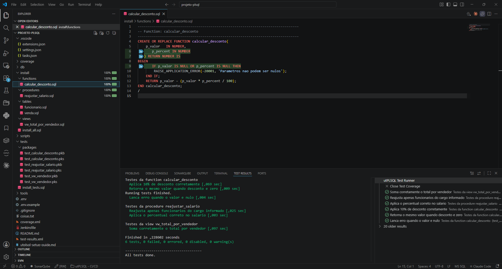
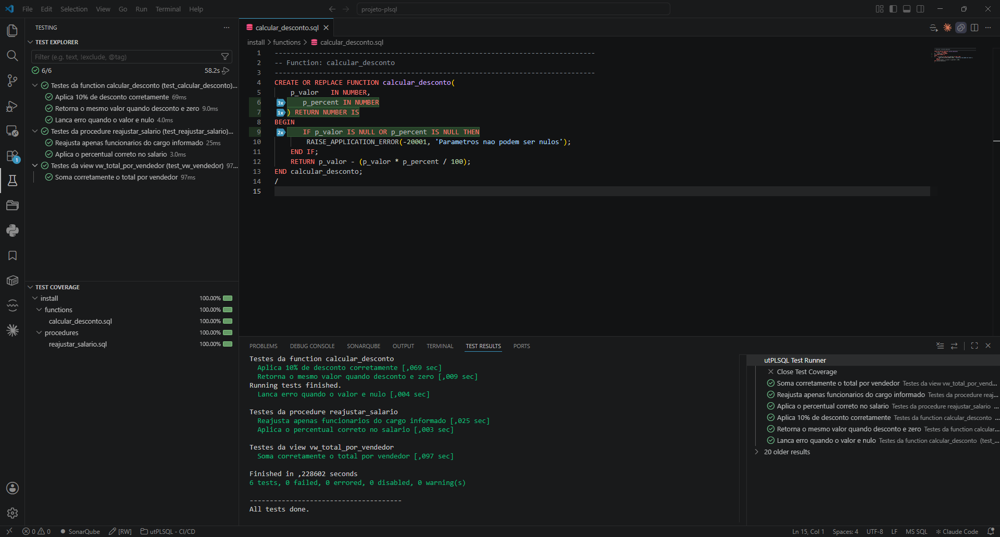

<p align="center">
  
</p>

# utPLSQL Test Runner

Integra o [utPLSQL](https://www.utplsql.org/) ao VSCode, trazendo os testes de PL/SQL para o **Test Explorer** nativo, com menu de contexto e cobertura visual.

- 🧪 **Test Explorer nativo** — suites e testes aparecem na view de testes; rode por teste, suite, arquivo ou pasta.
- 🖱️ **Menu de contexto** — clique direito em uma **pasta** ou em um arquivo **`.pks`/`.pkb`** (no Explorer ou no editor) para rodar os testes.
- ✅ **Resultados na view de testes** — verde/vermelho por teste, com a mensagem de falha do utPLSQL.
- 📊 **Cobertura visual** — gutters coloridos por linha (coberta/não coberta) e percentual por arquivo na aba **Coverage**, usando a Test Coverage API do VSCode.

## Instalação

A extensão pode ser instalada de duas formas:

1. **Pelo Marketplace:** Procure por **utPLSQL Test Runner** no painel de extensões do VSCode (`Ctrl+Shift+X`) e clique em **Instalar**.
2. **Manualmente (.vsix):** Baixe o arquivo `.vsix` da versão desejada e instale no VSCode:
   * **Via Linha de Comando:** `code --install-extension vscode-utplsql-<versao>.vsix`
   * **Via Interface:** Abra o painel de Extensões (`Ctrl+Shift+X`), clique nos três pontos `...` (canto superior direito) e selecione **Install from VSIX...**.

## Requisitos

- **Framework utPLSQL (UT3)** instalado no banco Oracle.
- **utPLSQL-cli** + **Java** instalados na máquina (a extensão chama o CLI).
- **VSCode 1.88+** (Test Coverage API).

A extensão é só o "cliente gráfico" — quem executa os testes é o banco, via CLI.

## Conexão

A extensão precisa de uma string de conexão Oracle para rodar os testes. A
resolução segue esta ordem:

1. **Setting `utplsql.connection`** — lido do `settings.json` do projeto/usuário.
2. **Variável de ambiente `UTPLSQL_CONN`** — definida antes de abrir o VSCode.
3. **Cache da sessão** — se o usuário já digitou a conexão via prompt.
4. **Prompt ao usuário** — pergunta e mantém só na sessão atual.

⚠️ **Recomendação de segurança:** a string de conexão contém senha. **NÃO** use o
setting `utplsql.connection` em ambientes compartilhados (o settings.json pode
ser versionado ou visível a outros). Em vez disso, **use a variável de ambiente
`UTPLSQL_CONN`**:

```powershell
# PowerShell
$env:UTPLSQL_CONN = "usuario/senha@//host:1521/servico"
code .
```

```bash
# Bash
export UTPLSQL_CONN="usuario/senha@//host:1521/servico"
code .
```

Se nem o setting nem a env var estiverem definidos, a extensão pergunta a
conexão e a mantém apenas em memória durante a sessão — use o comando
**utPLSQL: Limpar conexão da sessão** (palette de comandos) para limpá-la.

## Como funciona

```
 Test Explorer / menu de contexto
        │  (descobre %suite / %test nos .pks)
        ▼
 utplsql run <conn> -p=<suites>
   -f=ut_junit_reporter             -o=results.xml    ──► resultados na view de testes
   -f=ut_coverage_cobertura_reporter -o=coverage.xml  ──► gutters + % na aba Coverage
   -f=ut_documentation_reporter -c                    ──► log no terminal de testes
```

A extensão monta a linha de comando do CLI, lê os relatórios (JUnit + Cobertura) e os
traduz para as APIs nativas do VSCode.

## Configuração

| Setting | Default | Descrição |
|---|---|---|
| `utplsql.connection` | `""` | Conexão Oracle. **Deixe vazio** e use a variável de ambiente `UTPLSQL_CONN` para não gravar a senha. Se ambos vazios, a extensão pergunta (guarda só na sessão). |
| `utplsql.cliPath` | `utplsql` | Caminho do executável do utPLSQL-cli (ex.: `C:\tools\utPLSQL-cli\bin\utplsql.bat`). |
| `utplsql.sourcePath` | `install` | Pasta do código de produção (para mapear a cobertura aos arquivos). |
| `utplsql.includePatterns` | `["**/*.pks"]` | Globs para descobrir os specs com `%suite`/`%test`. Se seus testes estão em `.sql`, use `["**/*.sql"]`. |
| `utplsql.extraRunArgs` | `[]` | Argumentos extras para o `utplsql run`. |
| `utplsql.coverageOwner` | `""` | Schema dono dos objetos cobertos. Vazio = usa o usuário da conexão (em maiúsculas). |
| `utplsql.coverageSourceArgs` | (ver **Cobertura**) | Args do CLI que mapeiam a cobertura aos arquivos-fonte. |
| `utplsql.invocation` | `launcher` | Como chamar o CLI: `launcher` (via `.bat`/script, padrão) ou `java` (JVM direto, **sem shell**). Veja **Modo de invocação**. |
| `utplsql.javaPath` | `java` | Executável do Java (PATH ou caminho completo). Usado só no modo `java`. |
| `utplsql.cliHome` | `""` | Raiz do utPLSQL-cli (pasta com `bin/` e `lib/`). Vazio = derivado do `cliPath`. Usado só no modo `java`. |
| `utplsql.timeoutMinutes` | `60` | Timeout em minutos para o CLI (flag `-t`). |
| `utplsql.dbmsOutput` | `false` | Habilita `DBMS_OUTPUT` na sessão de teste (flag `-D`). |
| `utplsql.quiet` | `false` | Suprime logs informativos do CLI (flag `-q`). |
| `utplsql.failureExitCode` | `1` | Código de saída em caso de falha (flag `--failure-exit-code`). `0` faz o CLI sempre exitir com sucesso. |
| `utplsql.additionalReporters` | `[]` | Reporters adicionais para incluir em toda execução (ex.: `["ut_coverage_html_reporter"]`). Os padrões (documentation, junit, cobertura) são sempre incluídos e não precisam ser listados. |

Exemplo (`.vscode/settings.json` do projeto):

```jsonc
{
  "utplsql.cliPath": "C:\\tools\\utPLSQL-cli\\bin\\utplsql.bat",
  "utplsql.sourcePath": "install",
  // utplsql.connection fica vazio -> use a variável de ambiente UTPLSQL_CONN
}
```

E, antes de abrir o VSCode (ou no perfil do PowerShell):

```powershell
$env:UTPLSQL_CONN = "DEV/senha@//localhost:1521/XEPDB1"
```

### Modo de invocação (`launcher` vs `java`)

Por padrão (`utplsql.invocation = "launcher"`) a extensão chama o launcher
`utplsql`/`utplsql.bat`. No Windows isso passa pelo `cmd`, que **consome/interpreta
metacaracteres** (`^` vira escape, `|` vira pipe) — o que atrapalha regex em
`coverageSourceArgs`.

O modo `java` chama a JVM **direto** (`java -cp <home>/etc;<home>/lib/* …
org.utplsql.cli.Cli`), **sem shell**. Os argumentos vão para o processo como um array,
sem `cmd` no meio, então `^` e `|` passam **literais** — você pode usar `^âncoras$` e
`(a|b|c)` no regex sem contornos.

```jsonc
{
  "utplsql.invocation": "java",
  "utplsql.cliPath": "C:\\tools\\utPLSQL-cli\\bin\\utplsql.bat", // cliHome é derivado daqui
  // "utplsql.cliHome": "C:\\tools\\utPLSQL-cli",  // só se cliPath for um comando do PATH
  // "utplsql.javaPath": "java"                     // PATH, ou caminho completo do java.exe
}
```

> O modo `java` replica fielmente o que o `.bat` faz (mesmo classpath e mesmas
> propriedades `-D`); a única diferença é não passar pelo `cmd`. Requer o `java` no PATH
> (ou em `utplsql.javaPath`) e que a raiz do CLI seja resolvível — ou via `cliPath`
> apontando para `…/bin/utplsql(.bat)`, ou definindo `cliHome`.

## Uso

1. Abra o projeto PL/SQL (com o código e os packages de teste).
2. Compile o código e os testes no banco (extensão Oracle / SQLcl).
3. Abra a view **Testing** → as suites aparecem.
4. Rode:
   - Pelo **gutter** ao lado de cada teste/suite, ou
   - Botão **Run Tests** da view, ou
   - **Clique direito** numa pasta/arquivo → *utPLSQL: Rodar testes…* (com ou sem cobertura).
5. Para cobertura, use o perfil **Run with Coverage** (ou o item de menu "com cobertura").
6. Para diagnóstico, use o comando **utPLSQL: Mostrar informações do utPLSQL** na palette (`Ctrl+Shift+P`) — exibe as versões do CLI, da API Java e do utPLSQL no banco, com opção de copiar.
7. **utPLSQL: Selecionar reporter adicional...** — QuickPick com reporters disponíveis no banco. O selecionado é usado na execução seguinte e descartado após.
8. **utPLSQL: Cancelar execução** — interrompe o CLI em execução.
9. **utPLSQL: Atualizar testes** — força rediscovery dos `.pks`.

## Cobertura

- Linhas **executadas** ficam verdes no gutter; **não executadas**, vermelhas.
- A aba **Test Coverage** mostra o **percentual por arquivo/pasta**.

<p align="center">
  
</p>

<p align="center">
  
</p>

A extensão passa `-source_path` (= `utplsql.sourcePath`) e mapeia os objetos cobertos
aos arquivos-fonte via `utplsql.coverageSourceArgs` (regex + `type_mapping`). O `-owner`
é derivado da conexão (ou de `utplsql.coverageOwner`).

### Mapeamento da cobertura aos arquivos (`coverageSourceArgs`)

O `type_mapping` traduz o "tipo" capturado pelo regex no tipo Oracle. Três convenções comuns:

**1) Por diretório** — estrutura `sourcePath/<tipo>/<nome>.sql` (pastas `functions/`, `procedures/`, `packages/`, …):
```jsonc
"utplsql.coverageSourceArgs": [
  "-regex_expression=.*[/\\\\](\\w+)[/\\\\](\\w+)\\.sql$",
  "-type_subexpression=1",   // grupo 1 = pasta (tipo)
  "-name_subexpression=2",   // grupo 2 = arquivo (nome do objeto)
  "-type_mapping=packages=PACKAGE BODY/functions=FUNCTION/procedures=PROCEDURE/triggers=TRIGGER"
]
```
> Funciona em qualquer profundidade (o `.*` absorve os módulos acima). Nomes de pasta variados
> (ex.: `package`, `pkg`, `pacote`) podem ser enumerados no `type_mapping`.

**2) Por prefixo do nome** — convenção `pkg_*`, `prc_*`, `vw_*` (independe da pasta):
```jsonc
"utplsql.coverageSourceArgs": [
  "-regex_expression=.*[/\\\\]((pkg|prc|fnc|trg|vw)_\\w+)\\.sql$",
  "-name_subexpression=1",   // grupo 1 = nome completo (ex.: PKG_EXEMPLO)
  "-type_subexpression=2",   // grupo 2 = prefixo (tipo)
  "-type_mapping=pkg=PACKAGE BODY/prc=PROCEDURE/fnc=FUNCTION/trg=TRIGGER/vw=VIEW"
]
```

**3) Por extensão tipada** — arquivos `*.pkb`, `*.fnc`, `*.prc`, `*.trg` (independe da pasta):
```jsonc
"utplsql.coverageSourceArgs": [
  "-regex_expression=.*[/\\\\](\\w+)\\.(\\w+)$",
  "-name_subexpression=1",   // grupo 1 = nome
  "-type_subexpression=2",   // grupo 2 = extensão (tipo)
  "-type_mapping=pkb=PACKAGE BODY/fnc=FUNCTION/prc=PROCEDURE/trg=TRIGGER"
]
```

**Notas importantes:**
- **Packages → `PACKAGE BODY`** (não `PACKAGE`): a cobertura é coletada no **corpo** do package.
- **Windows / metacaracteres no regex:** no modo `launcher` (padrão), o `.bat` passa pelo `cmd`,
  que **consome o `^`** e **interpreta o `|` como pipe** — por isso os exemplos acima usam `\w` e
  `[/\\]` (sem `^`), e o `|` do exemplo 2 só funciona dentro da extensão. **Solução:** use **`utplsql.invocation = "java"`** (ver
  [Modo de invocação](#modo-de-invocação-launcher-vs-java)) — sem `cmd` no meio, `^` e `|` passam
  literais e você fica livre para escrever o regex normalmente.
- **Windows / `cmd`:** evite **`^`** no regex (o `cmd` do `.bat` o consome) — por isso os exemplos
  usam `\w` e `[/\\]`.

## Reporters

A extensão sempre inclui três reporters padrão:
`ut_documentation_reporter` (stdout),
`ut_junit_reporter` (resultados → Test Explorer) e
`ut_coverage_cobertura_reporter` (cobertura, se disponível).

**Validação dinâmica** — antes de rodar com cobertura, a extensão consulta
o banco via `utplsql reporters <conn>`. Se
`UT_COVERAGE_COBERTURA_REPORTER` não existir no banco (ex.: utPLSQL
desatualizado), a cobertura é pulada com um aviso no output. A execução
dos testes nunca é bloqueada.

**Reporters adicionais fixos** — setting `utplsql.additionalReporters`:
```jsonc
"utplsql.additionalReporters": ["UT_COVERAGE_HTML_REPORTER"]
```
Os três reporters padrão são deduplicados automaticamente, mesmo se
listados aqui.

**Reporter volátil por sessão** — comando **utPLSQL: Selecionar reporter
adicional...** abre um QuickPick com a lista dinâmica do banco. O reporter
escolhido é usado na execução seguinte e descartado após (não persiste
nas settings).

## Requisitos no banco

**Cobertura** (sempre) — habilita o profiler:
```sql
GRANT EXECUTE ON SYS.DBMS_PROFILER TO <schema_que_roda_os_testes>;
GRANT EXECUTE ON SYS.DBMS_PLSQL_CODE_COVERAGE TO <schema_que_roda_os_testes>;
```
Sem isso, os testes rodam mas a cobertura sai **vazia**.

**Descoberta de testes em OUTROS schemas** (install **compartilhado** do utPLSQL, ex.: owner `UT3`):
para o framework enxergar e parsear os testes dos schemas de aplicação, o owner do utPLSQL precisa
**ler o dicionário** desses schemas:
```sql
GRANT SELECT ON SYS.DBA_SOURCE     TO <ut3_owner>;
GRANT SELECT ON SYS.DBA_OBJECTS    TO <ut3_owner>;
GRANT SELECT ON SYS.DBA_PROCEDURES TO <ut3_owner>;
```
- **`SELECT ANY DICTIONARY` sozinho NÃO basta** — precisa dos grants **diretos** nessas views
  (por causa do `dbms_assert.sql_object_name` em contexto definer).
- É preciso também o **gatilho de DDL** do utPLSQL instalado (mantém o cache de annotations em dia).
- Verificação (como o owner): `SELECT ut_metadata.get_source_view_name FROM dual;` deve retornar `dba_source`.

> Em install **por schema** (utPLSQL no mesmo schema dos testes), esses grants cross-schema **não**
> são necessários — o framework lê o próprio source.

> 💡 **Ao escrever testes:** deixe uma **linha em branco** separando o `%suite` dos `%test`/procedures,
> senão o `%suite` "gruda" na procedure e o package não é reconhecido como suíte.

## Limitações conhecidas

- O mapeamento resultado→teste é feito por nome de package + nome/descrição do teste;
  descrições idênticas em packages diferentes podem gerar ambiguidade (o índice é
  escopado por package para minimizar isso).
- Considera o **primeiro** workspace folder para resolver `sourcePath`.
- A descoberta lê os `.pks` (specs); mantenha as annotations `%suite`/`%test` no spec.

## Licença

MIT © Gil Cleber Barboza
