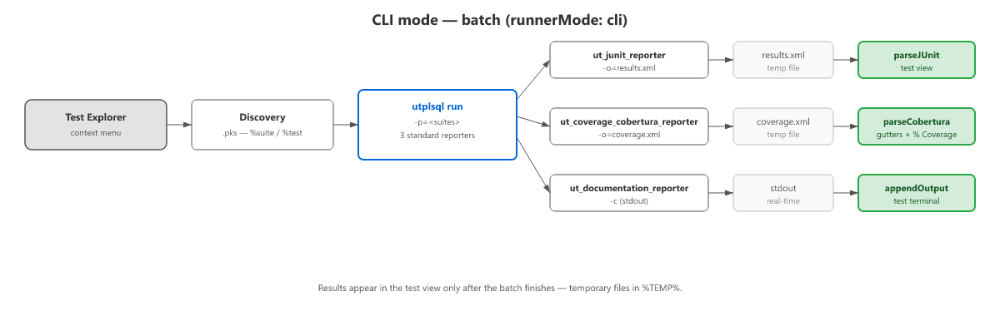

<p align="center">
  
</p>

<p align="center">
  [English](README.md) · [Português](README.pt-BR.md) · [Español](README.es.md) · [Français](README.fr.md) · [Deutsch](README.de.md) · [Italiano](README.it.md) · [日本語](README.ja.md) · [中文(简体)](README.zh-CN.md) · [中文(繁體)](README.zh-TW.md) · [한국어](README.ko.md) · [Русский](README.ru.md) · [Türkçe](README.tr.md) · [Polski](README.pl.md) · [Čeština](README.cs.md) · [Magyar](README.hu.md) · [Български](README.bg.md) · [Ελληνικά](README.el.md) · [Bahasa Indonesia](README.id.md) · [Română](README.ro.md) · [Српски](README.sr.md) · [ไทย](README.th.md) · [Українська](README.uk.md) · **Tiếng Việt** · [English (UK)](README.en-GB.md)
</p>

# utPLSQL Test Runner

Tích hợp [utPLSQL](https://www.utplsql.org/) vào VSCode, đưa các bài kiểm thử PL/SQL vào **Test Explorer** gốc, kèm menu ngữ cảnh và độ phủ mã trực quan.

- 🧪 **Test Explorer gốc** — các suite và bài kiểm thử xuất hiện trong khung testing; chạy theo bài kiểm thử, suite, tệp hoặc thư mục.
- 🔍 **CodeLens** — nút Run/Run with Coverage trên `%suite` và `%test` ngay trong trình soạn thảo, không cần rời khỏi mã.
- ⌨️ **Phím tắt** — tiền tố `Ctrl+Shift+U` + phím cho các lệnh chính (R = Chạy tất cả, T = Chạy tệp, L = Chạy lại lần cuối, v.v.).
- 🖱️ **Menu ngữ cảnh** — bấm chuột phải vào một **thư mục** hoặc tệp **`.pks`/`.pkb`** (trong Explorer hoặc trong trình soạn thảo) để chạy kiểm thử.
- 📊 **Độ phủ mã trực quan** — phần lề (gutter) tô màu theo từng dòng (đã phủ/chưa phủ) và tỷ lệ phần trăm theo tệp trong tab **Coverage**.
- ✅ **Trang trí nội tuyến** — các biểu tượng ✓/✗/⚠ trong trình soạn thảo sau khi chạy, kèm tooltip lỗi và thanh overview ruler.
- 📌 **Thanh trạng thái** — chỉ báo số lượng đạt/không đạt, thời lượng và tiến trình theo thời gian thực.
- 🔁 **Chạy lại thông minh** — Chạy lại lần cuối, Chạy tại con trỏ, Chỉ chạy các bài thất bại chỉ với một phím tắt.
- 🚀 **Oracle trực tiếp (qua node-oracledb)** — streaming theo thời gian thực, không cần chờ batch hoàn tất.
- 🔧 **Chẩn đoán thiết lập** — xác thực chủ động CLI, kết nối, quyền (grants) và phiên bản kèm quick-fix.
- 🧩 **Cây theo schema** — tổ chức kiểm thử theo Schema > Package > Suite > Test trong Test Explorer.
- 🎯 **Nhảy tới lỗi** — điều hướng trực tiếp tới dòng của assertion bị lỗi (qua "Go to Error" gốc).
- 🔌 **Hồ sơ kết nối** — lưu và chuyển đổi giữa nhiều môi trường (DEV/TEST/PROD) với cài đặt theo hồ sơ, qua thanh trạng thái hoặc command palette.
- 📈 **Độ phủ câu lệnh và view** — tab Coverage hiển thị `% câu lệnh` (PROCEDURE/FUNCTION) theo tệp và theo dõi các view được thực thi qua `V$SQL`.
- 🐛 **Gỡ lỗi PL/SQL** — breakpoint và gỡ lỗi từng bước các bài kiểm thử utPLSQL qua `DBMS_DEBUG` (Debug Adapter gốc).
- 🌍 **i18n — 24 ngôn ngữ** — `utplsql.language` theo VSCode (15 gốc + 9 cộng đồng: pt-br, en, en-gb, es, zh-cn, zh-tw, ja, de, fr, it, ko, ru, tr, pl, cs, hu, bg, el, id, ro, sr, th, uk, vi).

## Cài đặt

Extension có thể được cài đặt theo hai cách:

1. **Từ Marketplace:** Tìm **utPLSQL Test Runner** trong bảng extensions của VSCode (`Ctrl+Shift+X`) rồi bấm **Install**.
2. **Thủ công (.vsix):** Tải tệp `.vsix` của phiên bản mong muốn và cài đặt nó trong VSCode:
   * **Qua dòng lệnh:** `code --install-extension vscode-utplsql-<version>.vsix`
   * **Qua giao diện:** Mở bảng Extensions (`Ctrl+Shift+X`), bấm vào ba dấu chấm `...` (góc trên bên phải) và chọn **Install from VSIX...**.

## Yêu cầu

- [**utPLSQL**](https://github.com/utPLSQL/utPLSQL) **(UT3)** được cài đặt trong cơ sở dữ liệu Oracle.
- **Cho chế độ CLI:** [**utPLSQL-cli**](https://github.com/utPLSQL/utPLSQL-cli/releases) + **Java** được cài trên máy (extension gọi CLI).
- **Cho chế độ Oracle trực tiếp:** không cần gì ngoài cơ sở dữ liệu — VSIX đã kèm sẵn driver mỏng `oracledb` (không cần Instant Client).
- **VSCode 1.88+** (Test Coverage API).

Extension chỉ là "client đồ họa" — thứ thực sự chạy kiểm thử là cơ sở dữ liệu: qua
CLI (utPLSQL-cli + Java) hoặc trực tiếp (node-oracledb, `runnerMode: auto` mặc định).

## Kết nối

Extension cần một chuỗi kết nối Oracle để chạy kiểm thử. Thứ tự phân giải như sau:

1. **Hồ sơ kết nối đang hoạt động** — `utplsql.activeProfile` trỏ tới một hồ sơ trong `utplsql.profiles` (ghi đè mọi thứ bên dưới).
2. **Cài đặt `utplsql.connection`** — được đọc từ `settings.json` của dự án/người dùng.
3. **Biến môi trường `UTPLSQL_CONN`** — được đặt trước khi mở VSCode.
4. **Bộ nhớ đệm phiên** — nếu người dùng đã gõ kết nối qua prompt.
5. **Hỏi người dùng** — hỏi và chỉ giữ trong phiên hiện tại.

Các hồ sơ kết nối (`utplsql.profiles`) cũng có thể ghi đè `sourcePath`, `coverageOwner`,
`invocation`, `cliPath`, v.v. theo từng môi trường — xem `utplsql.activeProfile` trong bảng cấu hình.

⚠️ **Khuyến nghị bảo mật:** chuỗi kết nối chứa mật khẩu. **KHÔNG** dùng cài đặt
`utplsql.connection` trong các môi trường dùng chung (settings.json có thể bị quản lý phiên bản
hoặc lộ cho người khác). Thay vào đó, **hãy dùng biến môi trường `UTPLSQL_CONN`**:

```powershell
# PowerShell
$env:UTPLSQL_CONN = "user/password@//host:1521/service"
code .
```

```bash
# Bash
export UTPLSQL_CONN="user/password@//host:1521/service"
code .
```

Nếu cả cài đặt lẫn biến môi trường đều không được định nghĩa, extension sẽ hỏi chuỗi kết nối và
chỉ giữ nó trong bộ nhớ ở phiên hiện tại — dùng lệnh
**utPLSQL: Clear session connection** (command palette) để xóa.

**Các định dạng được chấp nhận:**
- **EZ Connect**: `user/pass@//host:1521/service`
- **TNS alias**: `user/pass@tns_alias` (cần cấu hình `TNS_ADMIN`)
- **Wallet (Oracle Cloud)**: `user/pass@tcps://host:1522/service?wallet_location=/path/wallet`

## Cách hoạt động

Có hai chế độ thực thi:


### Chế độ Oracle trực tiếp (v0.9.0) — `runnerMode: auto` hoặc `oracle`


Không có tệp tạm, không chờ batch. Kết quả xuất hiện trong
Test Explorer **ngay khi từng bài kiểm thử hoàn tất**.

### Chế độ CLI — `runnerMode: cli` (dự phòng)



Extension dựng dòng lệnh CLI hoặc kết nối Oracle trực tiếp, đọc các báo cáo
(JUnit + Coverage) rồi chuyển chúng thành các API gốc của VSCode. Chế độ `auto`
(mặc định) thử Oracle trực tiếp và rơi về CLI nếu `node-oracledb` chưa được cài.
Dùng `runnerMode: cli` để luôn ép dùng CLI.

## Cấu hình

| Cài đặt | Mặc định | Mô tả |
|---|---|---|
| `utplsql.connection` | `""` | Chuỗi kết nối Oracle. **Để trống** và dùng biến môi trường `UTPLSQL_CONN` để tránh lưu mật khẩu. Nếu cả hai đều trống, extension sẽ hỏi (chỉ giữ trong phiên). |
| `utplsql.cliPath` | `utplsql` | Đường dẫn tới tệp thực thi utPLSQL-cli (ví dụ `C:\tools\utPLSQL-cli\bin\utplsql.bat`). |
| `utplsql.sourcePath` | `install` | Thư mục chứa mã sản phẩm (để ánh xạ độ phủ tới các tệp). |
| `utplsql.includePatterns` | `["**/*.pks"]` | Các glob để tìm các spec chứa `%suite`/`%test`. Nếu kiểm thử của bạn nằm trong `.sql`, dùng `["**/*.sql"]`. |
| `utplsql.extraRunArgs` | `[]` | Các đối số bổ sung cho `utplsql run`. |
| `utplsql.coverageOwner` | `""` | Schema sở hữu các đối tượng được phủ. Trống = dùng người dùng kết nối (in hoa). |
| `utplsql.coverageSourceArgs` | (xem **Độ phủ**) | Các đối số CLI để ánh xạ độ phủ tới các tệp nguồn. |
| `utplsql.invocation` | `launcher` | Cách gọi CLI: `launcher` (qua `.bat`/script, mặc định) hoặc `java` (JVM trực tiếp, **không qua shell**). Xem **Chế độ gọi**. |
| `utplsql.javaPath` | `java` | Tệp thực thi Java (PATH hoặc đường dẫn đầy đủ). Chỉ dùng trong chế độ `java`. |
| `utplsql.cliHome` | `""` | Thư mục gốc của utPLSQL-cli (thư mục chứa `bin/` và `lib/`). Trống = suy ra từ `cliPath`. Chỉ dùng trong chế độ `java`. |
| `utplsql.timeoutMinutes` | `60` | Thời gian chờ (phút) cho CLI. Cờ `-t` chỉ được gửi nếu giá trị khác `60`. |
| `utplsql.dbmsOutput` | `false` | Bật `DBMS_OUTPUT` trong phiên kiểm thử. Cờ `-D` chỉ được gửi khi `true`. |
| `utplsql.quiet` | `false` | Ẩn các log CLI dạng thông tin. Cờ `-q` chỉ được gửi khi `true`. |
| `utplsql.failureExitCode` | `1` | Mã thoát khi gặp lỗi. Cờ `--failure-exit-code` chỉ được gửi nếu giá trị khác `1`. `0` khiến CLI luôn thoát thành công. |
| `utplsql.additionalReporters` | `[]` | Các reporter bổ sung đưa vào mỗi lần chạy (ví dụ `["ut_coverage_html_reporter"]`). Các reporter mặc định (documentation, junit, coverage) luôn được bao gồm và không cần liệt kê. |
| `utplsql.codeLens.enabled` | `true` | Hiển thị các nút CodeLens Run/Run with Coverage trên `%suite` và `%test`. |
| `utplsql.statusBar.enabled` | `true` | Hiển thị chỉ báo trạng thái kiểm thử trên thanh trạng thái. |
| `utplsql.decorations.enabled` | `true` | Hiển thị các trang trí đạt/không đạt trên các dòng `%suite` và `%test` sau khi chạy. |
| `utplsql.runnerMode` | `auto` | Chế độ thực thi: `auto` (Oracle trực tiếp qua node-oracledb, dự phòng CLI), `cli` (luôn qua dòng lệnh), `oracle` (luôn Oracle trực tiếp). |
| `utplsql.oraclePoolMin` | `2` | Số kết nối tối thiểu giữ trong pool của Oracle runner (node-oracledb). |
| `utplsql.oraclePoolMax` | `10` | Số kết nối tối đa trong pool của Oracle runner (node-oracledb). |
| `utplsql.oraclePoolIncrement` | `1` | Mức tăng khi mở rộng pool của Oracle runner (node-oracledb). |
| `utplsql.oraclePoolPingInterval` | `60` | Số giây giữa các lần kiểm tra sức khỏe của các kết nối nhàn rỗi trong pool (node-oracledb). `0` = ping mỗi lần checkout. |
| `utplsql.javaArgs` | `["-Xmx256m"]` | Các cờ JVM cho chế độ `java` (ví dụ `["-Xmx512m", "-Xms128m"]`). Được chèn trước `-cp`. |
| `utplsql.organization` | `file` | Tổ chức cây: `file` (theo đường dẫn) hoặc `schema` (Schema > Package > Suite > Test). Trong chế độ `schema` với `runnerMode` Oracle (`auto`/`oracle`), các suite cũng được phát hiện từ cơ sở dữ liệu (`ALL_OBJECTS`/`ALL_SOURCE`) khi các tệp `.pks` không nằm trong workspace — với URI ảo `utplsql-db:/` (không có CodeLens/trang trí/nhảy tới lỗi). |
| `utplsql.organization.schemaPattern` | `db/{schema}/**` | Glob để trích xuất schema từ đường dẫn. Dùng `{schema}` làm placeholder. Trong chế độ `schema`, các thư mục bên dưới gốc của pattern (ví dụ `db/*`) định nghĩa các schema được truy vấn trong cơ sở dữ liệu. |
| `utplsql.compilationDiagnostics.enabled` | `true` | Hiển thị lỗi biên dịch PL/SQL dưới dạng gạch chân trong trình soạn thảo và Problems Panel (chế độ CLI). |
| `utplsql.setupDiagnostics.enabled` | `true` | Hiển thị chẩn đoán cấu hình (CLI, kết nối, grants, phiên bản) và **tính toàn vẹn của bản cài utPLSQL** (các đối tượng không hợp lệ trong schema UT3, kèm quick-fix "Recompile UT3") với các hành động quick-fix. |
| `utplsql.profiles` | `[]` | Các hồ sơ kết nối Oracle đã lưu (tên, kết nối và ghi đè `sourcePath`/`coverageOwner`/`invocation`/`cliPath`/v.v.) để chuyển đổi giữa các môi trường. |
| `utplsql.activeProfile` | `""` | ID của hồ sơ đang hoạt động (`utplsql.profiles`). Khi được đặt, ghi đè `utplsql.connection`. |
| `utplsql.sqlCoverageEnabled` | `false` | Theo dõi các view được thực thi qua `V$SQL` (độ phủ boolean). Cần `GRANT SELECT ON V$SQL`. |
| `utplsql.debugger.enabled` | `true` | Bật gỡ lỗi kiểm thử PL/SQL (`DBMS_DEBUG`). Cần `node-oracledb` + grants. |
| `utplsql.debugger.stopOnException` | `true` | Tạm dừng khi có exception PL/SQL trong lúc gỡ lỗi. |
| `utplsql.debugger.timeoutSeconds` | `300` | Thời gian chờ (giây) của phiên gỡ lỗi. |
| `utplsql.language` | `auto` | Ngôn ngữ của các thông báo runtime. `auto` theo VSCode (pt, zh-tw/zh-hk, zh, es, ja, de, fr, it, ko, ru, tr, pl, cs, hu, bg, el, id, ro, sr, th, uk, vi, en-gb; nếu không thì en). Bao phủ **24 locale** (15 gốc + 9 cộng đồng). |

Ví dụ (`.vscode/settings.json` của dự án):

```jsonc
{
  "utplsql.cliPath": "C:\\tools\\utPLSQL-cli\\bin\\utplsql.bat",
  "utplsql.sourcePath": "install",
  // utplsql.connection stays empty -> use the UTPLSQL_CONN environment variable
}
```

Và, trước khi mở VSCode (hoặc trong PowerShell profile):

```powershell
$env:UTPLSQL_CONN = "DEV/password@//localhost:1521/XEPDB1"
```

### Dành cho người đóng góp

Tạo một tệp `.env` ở thư mục gốc của dự án (gitignored) với các biến môi
trường được dùng bởi các bài kiểm thử tích hợp:

```bash
UTPLSQL_CONN=your_user/password@//host:1521/service
UTPLSQL_CLI_PATH=/path/to/utplsql
UTPLSQL_CLI_HOME=/path/to/utplsql-cli
```

### Chế độ gọi (`launcher` vs `java`)

Mặc định (`utplsql.invocation = "launcher"`) extension gọi launcher
`utplsql`/`utplsql.bat`. Trên Windows điều này đi qua `cmd`, vốn
**tiêu thụ/giải thích các ký tự đặc biệt (metacharacters)** (`^` trở thành escape, `|` trở thành
pipe) — điều này làm hỏng regex trong `coverageSourceArgs`.

Chế độ `java` gọi JVM **trực tiếp** (`java -cp <home>/etc;<home>/lib/* …
org.utplsql.cli.Cli`), **không qua shell**. Các đối số được truyền tới tiến trình dưới
dạng mảng, không có `cmd` xen giữa, nên `^` và `|` đi qua **nguyên văn** — bạn có thể dùng
`^anchors$` và `(a|b|c)` trong regex mà không cần workaround.

```jsonc
{
  "utplsql.invocation": "java",
  "utplsql.cliPath": "C:\\tools\\utPLSQL-cli\\bin\\utplsql.bat", // cliHome is derived from here
  // "utplsql.cliHome": "C:\\tools\\utPLSQL-cli",  // only if cliPath is a PATH command
  // "utplsql.javaPath": "java"                     // PATH, or full path to java.exe
}
```

> Chế độ `java` tái hiện trung thực những gì `.bat` làm (cùng classpath và cùng các
> thuộc tính `-D`); điểm khác biệt duy nhất là không đi qua `cmd`. Cần `java` trên PATH
> (hoặc trong `utplsql.javaPath`) và thư mục gốc của CLI phải phân giải được — hoặc qua `cliPath`
> trỏ tới `…/bin/utplsql(.bat)`, hoặc bằng cách đặt `cliHome`.

## Sử dụng

1. Mở dự án PL/SQL (với mã và các package kiểm thử).
2. Biên dịch mã và kiểm thử trong cơ sở dữ liệu (extension Oracle / SQLcl).
3. Mở khung **Testing** → các suite xuất hiện.
4. Chạy:
   - Qua **CodeLens** — nút ▶ Run/Run with Coverage trên từng `%suite` và `%test` trong trình soạn thảo.
   - Qua **gutter** bên cạnh mỗi bài kiểm thử/suite, hoặc
   - Qua **phím tắt** (`Ctrl+Shift+U R` = Chạy tất cả, `Ctrl+Shift+U T` = Chạy tệp, v.v.), hoặc
   - Nút **Run Tests** của khung Test Explorer, hoặc
   - **Bấm chuột phải** vào thư mục/tệp → *utPLSQL: Run tests…* (có hoặc không có coverage).
5. Sau khi chạy, xem:
   - **Trang trí nội tuyến** (✓/✗/⚠) trong trình soạn thảo cạnh các annotation kiểm thử.
   - **Thanh trạng thái** với số lượng đạt/không đạt và tổng thời lượng.
   - **Test Explorer** với kết quả chi tiết.
6. Để đo độ phủ, dùng profile **Run with Coverage** (hoặc mục menu "with coverage").
7. Để lặp lại nhanh các lần chạy:
   - `Ctrl+Shift+U L` — **Rerun Last** (lặp lại lần chạy cuối, có hoặc không có coverage).
   - `Ctrl+Shift+U U` — **Run at Cursor** (chạy `%test`/`%suite` dưới con trỏ).
   - `Ctrl+Shift+U X` — **Run Failed Only** (chỉ chạy các bài kiểm thử bị lỗi).
8. **Với Oracle trực tiếp (streaming):** không cần cài gì thêm — VSIX đã kèm driver mỏng `oracledb`. Chế độ `auto` rơi về CLI nếu Oracle không truy cập được.
9. Để chẩn đoán, dùng `utPLSQL: Show information` trong palette — hiển thị phiên bản CLI/API/DB kèm tùy chọn sao chép.
10. **utPLSQL: Select additional reporter...** — QuickPick với các reporter có sẵn trong cơ sở dữ liệu.
11. **utPLSQL: Cancel execution** — dừng lần chạy đang thực hiện (`Escape` trong lúc chạy).
12. **utPLSQL: Refresh tests** — ép phát hiện lại các tệp `.pks`.

> 💡 **Khi viết kiểm thử:** bộ phân tích được điều khiển bằng token — chỉ cần có `%suite`
> và khai báo `create package` trong tệp, và mỗi `%test` theo sau bởi
> `PROCEDURE` của nó. Không có yêu cầu về dòng trống.

### Các annotation được hỗ trợ (v0.10.0+)

Ngoài `%suite` và `%test`, việc phát hiện còn hiểu:

| Annotation | Ảnh hưởng trên Test Explorer |
|---|---|
| `-- %disabled` | Suite hoặc bài kiểm thử **không xuất hiện** trong cây (bị bỏ qua khi phát hiện) |
| `-- %throws(-20001)` | Đánh dấu rằng bài kiểm thử mong đợi exception 20001 (metadata `expectedError`) |
| `-- %tags(fast, critical)` | Tag của bài kiểm thử (metadata; lọc theo tag nằm trong roadmap) |
| `-- %displayname(Name)` | Tên tùy chỉnh hiển thị thay cho mô tả của `%test` |
| `-- %beforeall` / `%beforeeach` / `%aftereach` / `%afterall` | Đánh dấu suite với các lifecycle hooks (metadata) |

Các annotation không phân biệt hoa thường. Trong phần đầu của suite (giữa `%suite` và
`%test` đầu tiên) chúng áp dụng cho suite; sau `%test`, chúng áp dụng cho bài kiểm thử.

## Lệnh

Tất cả các lệnh của extension (palette `Ctrl+Shift+P` tiền tố `utPLSQL:`):

| Lệnh | Mô tả | Phím tắt UI |
|---|---|---|
| `utPLSQL: Run all tests` | Chạy tất cả các suite trong workspace | Nút ▶ trong khung Testing |
| `utPLSQL: Run tests in this file` | Chạy các suite của tệp `.pks`/`.pkb` đang mở | Chuột phải → tệp |
| `utPLSQL: Run tests in this file with coverage` | Tương tự, với profile coverage | Chuột phải → tệp |
| `utPLSQL: Run tests in this folder` | Chạy các suite của thư mục đã chọn | Chuột phải → thư mục |
| `utPLSQL: Run tests in this folder with coverage` | Tương tự, với profile coverage | Chuột phải → thư mục |
| `utPLSQL: Refresh tests` | Ép phát hiện lại các tệp `.pks` | — |
| `utPLSQL: Cancel execution` | Dừng CLI đang chạy | — |
| `utPLSQL: Show utPLSQL information` | Phiên bản CLI/API/DB kèm tùy chọn sao chép | — |
| `utPLSQL: Select additional reporter...` | QuickPick với các reporter trong cơ sở dữ liệu | — |
| `utPLSQL: Clear session connection` | Xóa kết nối khỏi bộ nhớ đệm phiên | — |
| `utPLSQL: Rerun Last` | Lặp lại lần chạy cuối | `Ctrl+Shift+U L` |
| `utPLSQL: Run Test at Cursor` | Chạy bài kiểm thử dưới con trỏ | `Ctrl+Shift+U U` |
| `utPLSQL: Run Failed Tests` | Chạy lại chỉ các bài kiểm thử bị lỗi | `Ctrl+Shift+U X` |
| `utPLSQL: Validate configuration` | Chạy xác thực thiết lập đầy đủ (CLI, Java, kết nối, cài đặt UT3) và hiển thị kết quả | — |
| `utPLSQL: Configure connection` | Mở cài đặt tại `utplsql.connection` | — |
| `utPLSQL: Copy coverage grants to clipboard` | Sao chép SQL grants vào clipboard | — |
| `utPLSQL: Show Test Explorer` | Đưa tiêu điểm vào khung Testing | — |
| `utPLSQL: Switch connection profile...` | Chuyển hồ sơ kết nối đang hoạt động (QuickPick) | Bấm vào thanh trạng thái (khi có hồ sơ đang hoạt động) |
| `utPLSQL: New connection profile...` | Wizard tạo và kích hoạt một hồ sơ | — |
| `utPLSQL: Manage connection profiles` | Mở cài đặt tại `utplsql.profiles` | — |
| `utPLSQL: Import connections from SQL Developer` | Nhập kết nối từ SQL Developer (connections.xml) | — |
| `utPLSQL: Debug test (PL/SQL)` | Bắt đầu phiên gỡ lỗi của bài kiểm thử trong tệp đang mở | — |

> **Recompile UT3** (`utplsql.recompileUt3`) **không phải** là lệnh palette — nó là
> quick-fix nội bộ của diagnostic "utPLSQL Setup" (các đối tượng không hợp lệ trong
> schema utPLSQL).

## Phím tắt

Tất cả các phím tắt dùng tiền tố `Ctrl+Shift+U` (`Cmd+Shift+U` trên Mac):

| Phím tắt | Lệnh |
|---|---|
| `Ctrl+Shift+U R` | Chạy tất cả các bài kiểm thử |
| `Ctrl+Shift+U T` | Chạy các bài kiểm thử trong tệp |
| `Ctrl+Shift+U Shift+T` | Chạy các bài kiểm thử trong tệp có coverage |
| `Ctrl+Shift+U F` | Làm mới các bài kiểm thử |
| `Ctrl+Shift+U I` | Hiển thị thông tin utPLSQL |
| `Ctrl+Shift+U C` | Xóa kết nối phiên |
| `Ctrl+Shift+U L` | Chạy lại lần cuối |
| `Ctrl+Shift+U U` | Chạy tại con trỏ |
| `Ctrl+Shift+U X` | Chỉ chạy các bài bị lỗi |
| `Escape` | Hủy lần chạy |

## Độ phủ

- Các dòng **đã thực thi** chuyển sang màu xanh ở gutter; các dòng **chưa thực thi** chuyển sang màu đỏ.
- Tab **Test Coverage** hiển thị **phần trăm theo tệp/thư mục**.

<p align="center">
  
</p>

<p align="center">
  
</p>

Extension truyền `-source_path` (= `utplsql.sourcePath`) và ánh xạ các đối tượng được phủ
tới các tệp nguồn qua `utplsql.coverageSourceArgs` (regex + `type_mapping`). `-owner`
được suy ra từ kết nối (hoặc từ `utplsql.coverageOwner`).

### Ánh xạ độ phủ tới các tệp (`coverageSourceArgs`)

`type_mapping` dịch "loại" mà regex bắt được thành loại Oracle. Ba quy ước phổ biến:

**1) Theo thư mục** — cấu trúc `sourcePath/<type>/<name>.sql` (các thư mục `functions/`, `procedures/`, `packages/`, …):
```jsonc
"utplsql.coverageSourceArgs": [
  "-regex_expression=.*[/\\\\](\\w+)[/\\\\](\\w+)\\.sql$",
  "-type_subexpression=1",   // group 1 = folder (type)
  "-name_subexpression=2",   // group 2 = file (object name)
  "-type_mapping=packages=PACKAGE BODY/functions=FUNCTION/procedures=PROCEDURE/triggers=TRIGGER"
]
```
> Hoạt động ở mọi độ sâu (`.*` hấp thụ các module phía trên). Các tên thư mục đa dạng
> (ví dụ `package`, `pkg`, `pacote`) có thể được liệt kê trong `type_mapping`.

**2) Theo tiền tố tên** — quy ước `pkg_*`, `prc_*`, `vw_*` (không phụ thuộc vào thư mục):
```jsonc
"utplsql.coverageSourceArgs": [
  "-regex_expression=.*[/\\\\]((pkg|prc|fnc|trg|vw)_\\w+)\\.sql$",
  "-name_subexpression=1",   // group 1 = full name (e.g. PKG_EXAMPLE)
  "-type_subexpression=2",   // group 2 = prefix (type)
  "-type_mapping=pkg=PACKAGE BODY/prc=PROCEDURE/fnc=FUNCTION/trg=TRIGGER/vw=VIEW"
]
```

**3) Theo phần mở rộng được đánh loại** — các tệp `*.pkb`, `*.fnc`, `*.prc`, `*.trg` (không phụ thuộc vào thư mục):
```jsonc
"utplsql.coverageSourceArgs": [
  "-regex_expression=.*[/\\\\](\\w+)\\.(\\w+)$",
  "-name_subexpression=1",   // group 1 = name
  "-type_subexpression=2",   // group 2 = extension (type)
  "-type_mapping=pkb=PACKAGE BODY/fnc=FUNCTION/prc=PROCEDURE/trg=TRIGGER"
]
```

**Các lưu ý quan trọng:**
- **Packages → `PACKAGE BODY`** (không phải `PACKAGE`): độ phủ được thu thập trong **body** của package.
- **Windows / metacharacter của regex:** trong chế độ `launcher` (mặc định), `.bat` đi qua `cmd`,
  vốn **tiêu thụ `^`** và **giải thích `|` như pipe** — đó là lý do các ví dụ trên dùng `\w` và
  `[/\\]` (không có `^`), và `|` trong ví dụ 2 chỉ hoạt động bên trong extension. **Giải pháp:** dùng **`utplsql.invocation = "java"`** (xem
  [Chế độ gọi](#chế-độ-gọi-launcher-vs-java)) — không có `cmd` xen giữa, `^` và `|` đi qua
  nguyên văn và bạn có thể viết regex bình thường.
- **Windows / `cmd`:** tránh **`^`** trong regex (`cmd` của `.bat` tiêu thụ nó) — đó là lý do các ví dụ
  dùng `\w` và `[/\\]`.

## Bộ báo cáo (Reporters)

Extension luôn kèm ba reporter mặc định:
`ut_documentation_reporter` (stdout),
`ut_junit_reporter` (kết quả → Test Explorer) và
`ut_coverage_cobertura_reporter` (độ phủ, nếu có).

**Xác thực động** — trước khi chạy với độ phủ, extension truy vấn
cơ sở dữ liệu qua `utplsql reporters <conn>`. Nếu
`UT_COVERAGE_COBERTURA_REPORTER` không tồn tại trong cơ sở dữ liệu (ví dụ utPLSQL
đã cũ), độ phủ sẽ bị bỏ qua kèm cảnh báo trong output. Việc thực thi kiểm thử
không bao giờ bị chặn.

**Các reporter cố định bổ sung** — cài đặt `utplsql.additionalReporters`:
```jsonc
"utplsql.additionalReporters": ["UT_COVERAGE_HTML_REPORTER"]
```
Ba reporter mặc định tự động được loại bỏ trùng (deduplicated), kể cả khi được
liệt kê ở đây.

**Reporter thay đổi theo phiên** — lệnh **utPLSQL: Select additional
reporter...** mở QuickPick với danh sách động từ cơ sở dữ liệu. Reporter
được chọn sẽ được dùng ở lần chạy kế tiếp rồi bị loại bỏ sau đó (không lưu
trong cài đặt).

## Yêu cầu cơ sở dữ liệu

**Độ phủ (luôn luôn)** — bật profiler:
```sql
GRANT EXECUTE ON SYS.DBMS_PROFILER TO <schema_that_runs_the_tests>;
GRANT EXECUTE ON SYS.DBMS_PLSQL_CODE_COVERAGE TO <schema_that_runs_the_tests>;
```
Không có điều này, kiểm thử vẫn chạy nhưng độ phủ ra **trống**.

**Phát hiện kiểm thử trong các schema KHÁC** (bản cài utPLSQL **dùng chung**, ví dụ owner `UT3`):
để framework nhìn thấy và phân tích các bài kiểm thử của các schema ứng dụng, owner của utPLSQL cần
**đọc từ điển** của các schema đó:
```sql
GRANT SELECT ON SYS.DBA_SOURCE     TO <ut3_owner>;
GRANT SELECT ON SYS.DBA_OBJECTS    TO <ut3_owner>;
GRANT SELECT ON SYS.DBA_PROCEDURES TO <ut3_owner>;
```
- **Chỉ riêng `SELECT ANY DICTIONARY` là KHÔNG đủ** — cần các grant **trực tiếp** trên các view đó
  (vì `dbms_assert.sql_object_name` trong ngữ cảnh definer).
- **Trigger DDL** của utPLSQL cũng phải được cài đặt (giữ cho bộ nhớ đệm annotation luôn cập nhật).
- Kiểm tra (với tư cách owner): `SELECT ut_metadata.get_source_view_name FROM dual;` sẽ trả về `dba_source`.

> Trong các bản cài **per-schema** (utPLSQL trong cùng schema với kiểm thử), các grant xuyên schema này **không**
> cần thiết — framework đọc nguồn của chính nó.

## Hạn chế đã biết

- Việc ánh xạ kết quả→bài kiểm thử được thực hiện theo tên package + tên/mô tả bài kiểm thử;
  các mô tả giống hệt nhau trong các package khác nhau có thể tạo ra sự mơ hồ (chỉ mục được
  giới hạn theo package để giảm thiểu điều này).
- Chỉ xét **thư mục workspace đầu tiên** để phân giải `sourcePath`.
- Việc phát hiện đọc các tệp `.pks` (specs); hãy giữ các annotation `%suite`/`%test` trong spec.

## Xử lý sự cố

| Triệu chứng | Nguyên nhân có thể | Giải pháp |
|---|---|---|
| Các suite không xuất hiện | Không tìm thấy CLI | Chạy `utPLSQL: Validate configuration` để chẩn đoán |
| Độ phủ trống | Thiếu `GRANT EXECUTE ON DBMS_PROFILER` | Chạy các grant trong [Yêu cầu cơ sở dữ liệu](#yêu-cầu-cơ-sở-dữ-liệu) hoặc dùng `utPLSQL: Copy coverage grants to clipboard` |
| Độ phủ trống | Oracle 19c cần thêm grant | `GRANT EXECUTE ON DBMS_PROFILER` + `GRANT EXECUTE ON DBMS_PLSQL_CODE_COVERAGE` |
| Hiệu năng chậm | Suite lớn cần heap JVM nhiều hơn | Tăng `utplsql.javaArgs` (ví dụ `["-Xmx1024m"]`) |
| Lỗi biên dịch không kèm chỉ dẫn | Mã có lỗi cú pháp PL/SQL | Bật `utplsql.compilationDiagnostics.enabled` (mặc định bật); xem Problems Panel |
| Lỗi kết nối | Chuỗi sai định dạng hoặc DB không truy cập được | Dùng `utPLSQL: Validate configuration` |
| Hết thời gian khi chạy | Kiểm thử lâu hơn `timeoutMinutes` | Tăng `utplsql.timeoutMinutes` |
| Regex độ phủ không khớp | `cmd` của Windows tiêu thụ `^` và `\|` | Dùng `utplsql.invocation: "java"` (xem [Chế độ gọi](#chế-độ-gọi-launcher-vs-java)) |
| `%suite` không được nhận diện | Thiếu `%suite`/`create package` trong tệp, hoặc `%test` không có `PROCEDURE` | Kiểm tra spec; chạy `utPLSQL: Refresh tests` |
| "report not generated" | CLI không tạo được XML output | Kiểm tra quyền ghi trong `%TEMP%` và các grant utPLSQL |
| CodeLens không xuất hiện | `editor.codeLens` bị tắt hoặc xung đột | Bật `"editor.codeLens": true`; kiểm tra `utplsql.codeLens.enabled` |
| Phím tắt không hoạt động | Xung đột với extension hoặc phím tắt VSCode khác | Vào File → Preferences → Keyboard Shortcuts và tìm `utplsql` để gán lại |

## Giấy phép

MIT © Gil Cleber Barboza
