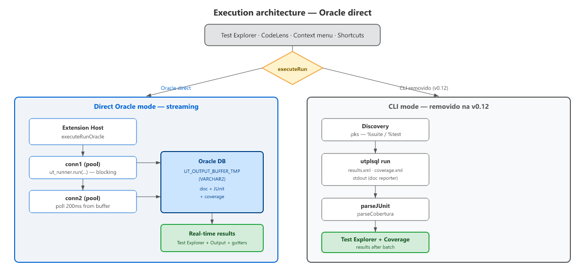
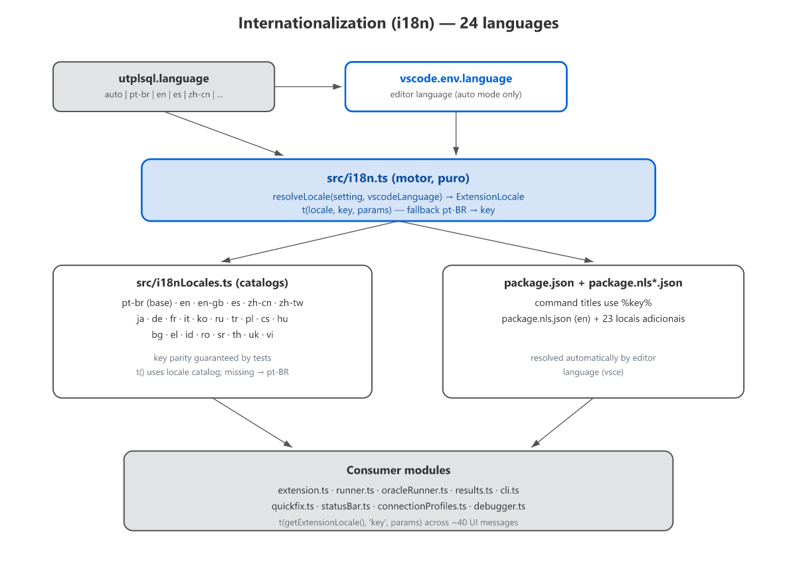

# Architecture

Overview of the extension's internal architecture for contributors.

## Execution flow

`src/extension.ts` is the orchestrator. `src/runner.ts` contains `executeRun`.
`src/oracleRunner.ts` contains `executeRunOracle`. The shared canonical
functions live in `src/results.ts` (`applyResultsFromCases`,
`applyCoverageFromXml`, `countResults`, `resolveStackFrameToUri`).

- `oracleRunner.ts`: conn1 executes `ut_runner.run(...)` (blocking); conn2 polls
  `UT_OUTPUT_BUFFER_TMP` every 200ms (real-time documentation +
  JUnit/Cobertura XML at the end).
- **Connection pooling (v0.10.0)**: managed pool (`ensurePool`), recreated if
  the connection changes, closed in `deactivate()` with a 10s drain.
- `discoverUtplsqlSchema`: `UT3.` prefix via `ALL_SYNONYMS` (shared install).

### Build (v0.11.0)

`main` points to `dist/extension.js` — a single bundle via **esbuild**
(`npm run bundle`), with `vscode` and `oracledb` **external**. The oracledb
native glue for **thick mode** lets the optional `utplsql.oracleClientMode =
thick` load a user-provided Oracle Instant Client; the thin driver remains the
default. The CI publishes **one VSIX per platform**: `win32-x64`, `linux-x64`,
`linux-arm64`, `darwin-arm64` with only that platform's glue (`thick+thin`), and
`win32-arm64`, `darwin-x64`, `linux-armhf`, `alpine-x64`, `alpine-arm64` as
**thin-only** fallback (no native binary — runs no-NNE databases). The universal
`npm run package` (all glues, ~2.5 MB) is for local testing. IAM/OCI auth `plugins/` are stripped — the extension only
uses user/pass connection. Pure deps (fast-xml-parser v5 + transitive) are
bundled.

## Critical separation: pure modules vs vscode-dependent

| Pure (testable with `node --test`) | Depends on `vscode` |
|---|---|
| `suiteParser.ts` — `%suite`/`%test` regex + annotations | `extension.ts` |
| `junit.ts` — JUnit XML parsing + stack frames | `runner.ts`, `results.ts` |
| `cobertura.ts` — Cobertura XML parsing | `config.ts` |
| `matching.ts` — URI/folder filter + result→test matching | `discovery.ts` |
| `codelens.ts` (parse) — `parseCodeLensItems` | `coverage.ts` — Cobertura → Coverage API |
| `state.ts`, `types.ts` (type-only) | `testTree.ts` — builds the tree (file/schema), `mergeDbSuites` |
| `plsqlDeclarations.ts` — extracts PROCEDURE/FUNCTION declarations from source | `scriptRunner.ts` — SQL script execution |
| `i18n.ts`, `i18nLocales.ts` — localization (24 locales) | `quickfix.ts` — setup diagnostics + quick-fix |
| `charset.ts` — byte→string decoding (utf8/latin1/win1252) | `compileForDebug.ts` — compile object with debug info |
| `charsetSupport.ts` — legacy-charset detection (euro preserved) | `compilationDiagnostics.ts` — ALL_ERRORS → Problems Panel |
| `debounce.ts` — coalescing helper | `dbSourceProvider.ts` — `utplsql-db:` virtual documents |
| `logger.ts` — logging (no `vscode`) | `connectionProfiles.ts` — connection profiles |
| | `decorations.ts` — inline ✓/✗/⚠ decorations |
| | `statusBar.ts` — status bar indicator |
| | `viewCoverage.ts` — DeclarationCoverage + V$SQL view tracking |
| | `dbmsDebug.ts`, `debugger.ts` — PL/SQL debugging via DBMS_DEBUG |
| | `oracleClient.ts` — thin/thick mode init |
| | `oracleRunner.ts` — pool, `executeRunOracle`, discovery helpers |

Modules in the left column **do not import `vscode`** (at runtime) and are
testable with `node --test` without any setup. Full list: `src/*.ts`.

## Context keys

| Key | When |
|---|---|
| `utplsql:activated` | Extension activated |
| `utplsql:running` | Execution in progress |
| `utplsql:connected` | Connection resolved/cleared |
| `utplsql:hasFailures` | Last run had failures |

## Settings data flow

| Setting (package.json) | config.ts (`readConfig`) | Usage |
|---|---|---|
| `utplsql.sourcePath` | `cfg.sourcePath` | `resolveSourceUri` (coverage mapping) |
| `utplsql.includePatterns` | `cfg.includePatterns` | `discovery.ts` (findFiles) |
| `utplsql.timeoutMinutes` | `cfg.timeoutMinutes` | run timeout (`Promise.race` + cancellation) |
| `utplsql.dbmsOutput` | `cfg.dbmsOutput` | captures `DBMS_OUTPUT` via `GET_LINES` on the polling session |
| `utplsql.additionalReporters` | `cfg.additionalReporters` | extra reporters in the `a_reporters` param of `ut_runner.run` (deduplicated) |
| `utplsql.tags` | `cfg.tags` | `a_tags` of `ut_runner.run` (server-side tag filter) |
| `utplsql.run.randomOrder`/`run.randomOrderSeed` | `cfg.randomOrder`/`randomOrderSeed` | `a_random_test_order`/`_seed` of `ut_runner.run` |
| `utplsql.coverage.schemes`/`includeObjects`/`excludeObjects` | `cfg.coverage*` | `a_coverage_schemes`/`a_include_objects`/`a_exclude_objects` binds |
| `utplsql.coverage.includeSchemaExpr`/`…ObjectExpr`/`exclude…Expr` | `cfg.coverage*Expr` | `a_include_*_expr`/`a_exclude_*_expr` binds of `ut_runner.run` |
| `utplsql.discovery.source` | `cfg.discoverySource` | `auto` \| `file` \| `database` — DB-first discovery (`testTree.ts`/`discovery.ts`) |
| `utplsql.oraclePoolMin/Max/Increment/PingInterval` | `cfg.oraclePool*` | `oracleRunner.ts` (`ensurePool`) |
| `utplsql.oracleClientMode`/`oracleClientLibDir`/`oracleClientConfigDir` | `cfg.oracleClient*` | `oracleClient.ts` (`ensureOracleClient`, called from `ensurePool`) |
| `utplsql.codeLens/statusBar/decorations.enabled` | `cfg.*Enabled` | UX providers |
| `utplsql.compilationDiagnostics.enabled` | `cfg.compilationDiagnosticsEnabled` | `compilationDiagnostics.ts` — ALL_ERRORS → Problems Panel (after each run) |
| `utplsql.setupDiagnostics.enabled` | `cfg.setupDiagnosticsEnabled` | `quickfix.ts` |
| `utplsql.organization`/`organization.schemaPattern` | `cfg.organization`/`organizationSchemaPattern` | `extension.ts` (tree + DB discovery) |
| `utplsql.connection` | `resolveConnection()` | Oracle connection param |
| `UTPLSQL_CONN` (env) | `resolveConnection()` (2nd source) | Oracle connection param |

## Test infrastructure

### vscode stub

Modules that import `vscode` (right column) use a two-layer stub system:

1. **Per test** — `src/test/unit/setup.ts` redirects `require('vscode')`
   to `src/test/vscode-stub.ts`
2. **Global runner** — `scripts/run-tests.cjs` with `--require scripts/test-setup.cjs`
   as a safety net

### Integration tests

`npm run test:integration` launches a VSCode instance via `@vscode/test-cli`.
Requires a real Oracle database + `UTPLSQL_CONN` defined in `.env`.

## Result → test mapping

`applyResultsFromCases` in `results.ts` (canonical function, v0.11.0) uses
heuristics: match by `package` (last segment of JUnit `classname`) +
test name/description, with name-based fallback. The match index is built
in `matching.ts` (pure functions `buildMatchIndex`/`findByNameOnly`), scoped
by package to minimize ambiguity. `applyResults` in `runner.ts` is just a
wrapper (errors when JUnit doesn't exist).

## Coverage file resolution

`resolveSourceUri` in `coverage.ts` tries:
1. Absolute path (already resolved)
2. Relative to workspace folder
3. Relative to `sourcePath`
