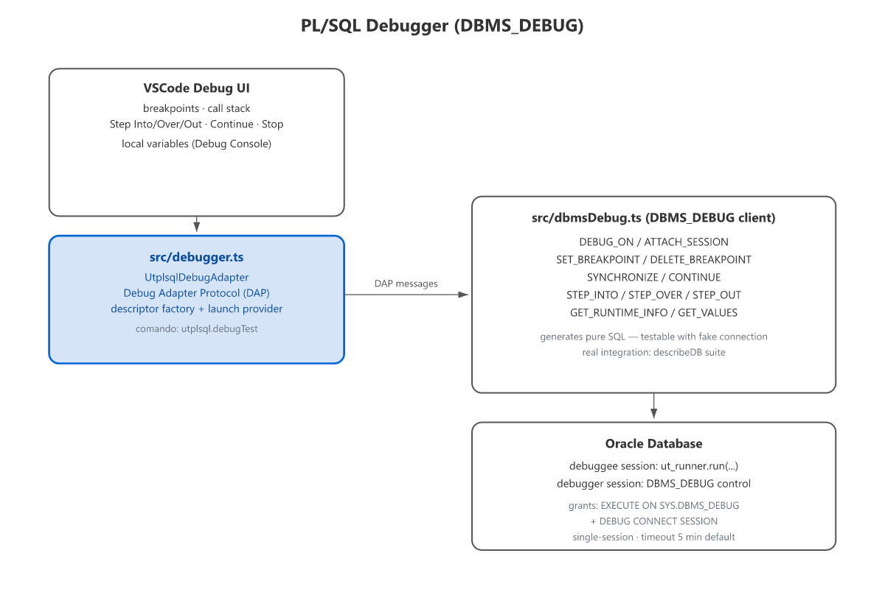

# PL/SQL Debugger

Debug your utPLSQL tests directly in VSCode's native Debug Adapter, using
Oracle's `DBMS_DEBUG`.

> Introduced in PRD-33; the client was rewritten against the real `DBMS_DEBUG`
> API in PRD-71 (0.12.1).

## How it works

The debugger uses **two Oracle sessions**:

```
debuggee session  ──► ut_runner.run(a_paths => pkg[.proc])   (runs the test)
debugger session  ──► DBMS_DEBUG: INITIALIZE / DEBUG_ON,
                      ATTACH_SESSION, SET_BREAKPOINT, CONTINUE, GET_VALUE
```

The debuggee enables debugging (`DEBUG_ON`) and runs the test. The debugger
session attaches to the target session id, sets breakpoints and drives execution
(`CONTINUE` + `breakflags`). The VSCode adapter (`utplsql`) translates the DAP
protocol into those calls.



> There are no `STEP_INTO`/`STEP_OVER`/`STEP_OUT` or `GET_VALUES` in
> `DBMS_DEBUG`. Stepping is `CONTINUE` with `breakflags`; variables are read one
> by one with `GET_VALUE(name)`.

Breakpoints are registered in the `DBMS_DEBUG` namespace that matches the file
type — `namespace_pkgspec_or_toplevel` for standalone procedures/functions,
`namespace_pkg_body` for package bodies, `namespace_trigger` for triggers — and
the file line is aligned to the stored object source when the file has a comment
header before the `CREATE` statement.

## Starting a session

- **Command palette:** `utPLSQL: Debug test (PL/SQL)` (`utplsql.debugTest`) —
  debugs the test/suite under the active `.pks`.
- **Editor context menu:** the same command is offered when right-clicking a
  `.pks`/`.pkb` file.
- **Run and Debug:** choose **utPLSQL Debugger** when creating a `launch.json`;
  the generated configuration uses `packageName: "${fileBasenameNoExtension}"`.

Breakpoints can be placed in `.pks`/`.pkb`/`.prc`/`.fnc`/`.trg` because the
extension contributes a `plsql` language and the matching `breakpoints`
contribution (otherwise VSCode disables the gutter on files without a language
id). Breakpoints are only applied **after** the target reaches the entry — the
`DBMS_DEBUG` silently ignores "deferred" breakpoints. While the session is not
there yet, breakpoints are queued and installed on entry.

`configurationDone` does **not** auto-continue: when the session is ready it
emits `stopped(reason=entry)` and waits for your **Continue**/Step — so you can
inspect the call stack and variables before the test starts.

## Launch configuration

The `utplsql` debugger type is declared with these `launch` attributes:

| Attribute | Required | Description |
|---|---|---|
| `packageName` | Yes | Test package to debug |
| `testName` | No | Specific test procedure |
| `connection` | No | Oracle connection string (resolved from profile/setting if omitted) |
| `stopOnException` | No | Pause on unhandled exceptions (default from `utplsql.debugger.stopOnException`) |

## Compiling for debug

The target object must be compiled with debug information for breakpoints to
hit. Instead of running the `ALTER` manually, use **`utPLSQL: Compile for
Debug`** (`utplsql.compileForDebug`):

- Command palette, editor context menu (`.pks`/`.pkb`/`.fnc`/`.prc`/`.trg`/`.sql`)
  and Explorer context menu (file or folder).
- It derives the Oracle object from the file (`.pks`/`.pkb` → package,
  `.fnc` → function, `.prc` → procedure, `.trg` → trigger; `.sql` is tried as
  package → procedure → function → trigger).
- The owner is the schema extracted from the path in `schema` mode, otherwise the
  connection user.
- It runs `ALTER <TYPE> "OWNER"."NAME" COMPILE DEBUG PLSQL_OPTIMIZE_LEVEL = 1`
  on the active connection/profile (reusing the runner pool) and reports the
  result. `COMPILE DEBUG` alone only sets `PLSQL_DEBUG` and keeps the optimizer
  level (default 2), which can remove/reorder lines and make breakpoints miss.

To automate it, set `utplsql.debugger.compileOnDebug` to `true`: the extension
then compiles the package with debug info before starting the debug session.

## Requirements

- `utplsql.debugger.enabled` = `true` (default).
- Target package compiled with debug information
  (`PLSQL_OPTIMIZE_LEVEL <= 1`, or `ALTER PACKAGE ... COMPILE DEBUG
  PLSQL_OPTIMIZE_LEVEL = 1`).
- Grants: `GRANT DEBUG CONNECT SESSION` and `GRANT EXECUTE ON SYS.DBMS_DEBUG`.
  See [[Database-requirements|Database Requirements]].

```sql
GRANT DEBUG CONNECT SESSION TO <schema>;
GRANT EXECUTE ON SYS.DBMS_DEBUG TO <schema>;
ALTER PACKAGE <schema>.<package> COMPILE DEBUG PLSQL_OPTIMIZE_LEVEL = 1;
```

## Settings

| Setting | Default | Description |
|---|---|---|
| `utplsql.debugger.enabled` | `true` | Enables PL/SQL test debugging |
| `utplsql.debugger.stopOnException` | `true` | Pauses when an unhandled exception is raised |
| `utplsql.debugger.timeoutSeconds` | `300` | Debug session timeout (terminates on expiry) |

## What you get

- Breakpoints in `.pks`/`.pkb`/`.prc`/`.fnc`/`.trg` (in the code under test —
  see Limitations for test packages)
- Continue, Step Into, Step Over, Step Out
- The current frame in the **Call Stack**
- Local variables in the **Variables** pane

## Limitations

- `pause` is not supported (no asynchronous interrupt in `DBMS_DEBUG`).
- Variables are read-only (no `setVariable`).
- A single frame is reported in the call stack.
- Breakpoints in the **test package** (`test_*.pkb`) may not hit: utPLSQL runs
  tests through dynamic SQL, which `DBMS_DEBUG` does not instrument. Put the
  breakpoints in the **code under test** (production function/procedure/package);
  those are hit normally through `ut_runner.run`.
- The debugger uses **dedicated connections** (not the runner pool): the debuggee
  stays blocked in `ut_runner.run` while you debug, and sharing the pool would
  exhaust it (`NJS-040 queueTimeout`). It respects the client mode
  (`utplsql.oracleClientMode`).

## Troubleshooting

If the session does not stop on a breakpoint:
- confirm the package was compiled with debug info;
- confirm the grants above;
- check the **Debug Console** for `[utplsql-debug]` messages (attach/timeout errors).
