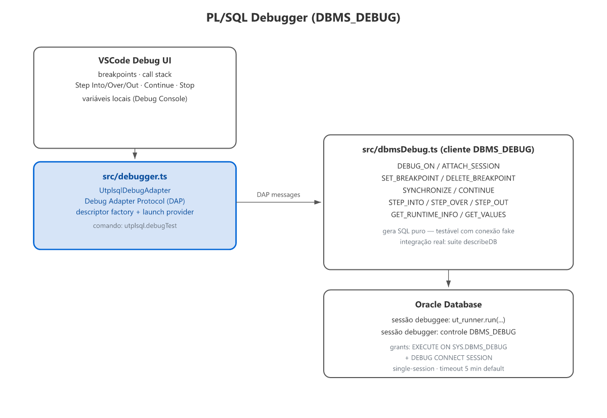

# Arquitetura

Visão geral da arquitetura interna da extensão para contribuidores.

## Fluxo de execução

`src/extension.ts` é o orquestrador. `src/runner.ts` contém `executeRun`.
`src/oracleRunner.ts` contém `executeRunOracle`. As funções canônicas
compartilhadas ficam em `src/results.ts` (`applyResultsFromCases`,
`applyCoverageFromXml`, `countResults`, `resolveStackFrameToUri`).

- `oracleRunner.ts`: conn1 executa `ut_runner.run(...)` (bloqueante); conn2 faz
  polling de `UT_OUTPUT_BUFFER_TMP` a cada 200ms (documentação em tempo real +
  XML JUnit/Cobertura no final).
- **Connection pooling (v0.10.0)**: pool gerenciado (`ensurePool`), recriado se
  a conexão mudar, fechado no `deactivate()` com drenagem de 10s.
- `discoverUtplsqlSchema`: prefixo `UT3.` via `ALL_SYNONYMS` (shared install).

### Build (v0.11.0)

O `main` aponta para `dist/extension.js` — bundle único via **esbuild**
(`npm run bundle`), com `vscode` e `oracledb` **externos**; os binários nativos
do oracledb são podados no VSIX (`.vscodeignore`), sobrando só o thin driver
(`plugins/` de auth IAM/OCI também é podado — a extensão usa apenas conexão
user/pass). Deps puras (fast-xml-parser v5 + transitivas, iconv-lite) vão
embutidas no bundle.

## Separação crítica: módulos puros vs vscode-dependentes

| Puro (testável com `node --test`) | Depende de `vscode` |
|---|---|
| `suiteParser.ts` — regex `%suite`/`%test` + annotations | `extension.ts` |
| `junit.ts` — parse XML JUnit + stack frames | `runner.ts`, `results.ts` |
| `cobertura.ts` — parse XML Cobertura | `config.ts` |
| `matching.ts` — filtro por URI/pasta + matching resultado→teste | `discovery.ts` |
| `codelens.ts` (parse) — `parseCodeLensItems` | |
| `state.ts`, `types.ts` (type-only) | |
| `plsqlDeclarations.ts` — extrai declarações PROCEDURE/FUNCTION do fonte | |
| `i18n.ts`, `i18nLocales.ts` — localização (24 locais) | |
| | `connectionProfiles.ts` — perfis de conexão |
| | `viewCoverage.ts` — DeclarationCoverage na aba Test Coverage |
| | `dbmsDebug.ts`, `debugger.ts` — debug PL/SQL via DBMS_DEBUG |

Módulos da coluna esquerda **não importam `vscode`** (em runtime) e são
testáveis com `node --test` sem qualquer setup.

## Context keys

| Key | Quando |
|---|---|
| `utplsql:activated` | Extensão ativada |
| `utplsql:running` | Execução em andamento |
| `utplsql:connected` | Conexão resolvida/limpa |
| `utplsql:hasFailures` | Último run teve falhas |

## Fluxo de dados das configurações

| Setting (package.json) | config.ts (`readConfig`) | Uso |
|---|---|---|
| `utplsql.sourcePath` | `cfg.sourcePath` | `-source_path` / `resolveSourceUri` |
| `utplsql.includePatterns` | `cfg.includePatterns` | `discovery.ts` (findFiles) |
| `utplsql.timeoutMinutes` | `cfg.timeoutMinutes` | `-t=N` (só se !=60) |
| `utplsql.dbmsOutput` | `cfg.dbmsOutput` | `-D` (só se true) |
| `utplsql.quiet` | `cfg.quiet` | `-q` (só se true) |
| `utplsql.failureExitCode` | `cfg.failureExitCode` | `--failure-exit-code` (só se !=1) |
| `utplsql.additionalReporters` | `cfg.additionalReporters` | `-f=` flags (deduplicados) |
| `utplsql.oraclePoolMin/Max/Increment/PingInterval` | `cfg.oraclePool*` | `oracleRunner.ts` (`ensurePool`) |
| `utplsql.codeLens/statusBar/decorations.enabled` | `cfg.*Enabled` | providers UX |
| `utplsql.compilationDiagnostics.enabled` | `cfg.compilationDiagnosticsEnabled` | `runner.ts` |
| `utplsql.setupDiagnostics.enabled` | `cfg.setupDiagnosticsEnabled` | `quickfix.ts` |
| `utplsql.organization`/`organization.schemaPattern` | `cfg.organization`/`organizationSchemaPattern` | `extension.ts` (árvore + descoberta via DB) |
| `utplsql.connection` | `resolveConnection()` | connection param Oracle |
| `UTPLSQL_CONN` (env) | `resolveConnection()` (2ª fonte) | connection param Oracle |

## Test infrastructure

### vscode stub

Módulos que importam `vscode` (coluna da direita) usam um sistema de stub
em duas camadas:

1. **Por teste** — `src/test/unit/setup.ts` redireciona `require('vscode')`
   para `src/test/vscode-stub.ts`
2. **Runner global** — `scripts/run-tests.cjs` com `--require scripts/test-setup.cjs`
   como rede de segurança

### Testes de integração

`npm run test:integration` sobe uma instância VSCode via `@vscode/test-cli`.
Requer banco Oracle real + `UTPLSQL_CONN` definido em `.env`.

## Mapeamento resultado → teste

`applyResultsFromCases` em `results.ts` (função canônica, v0.11.0) usa
heurística: casa por `package` (último segmento do `classname` JUnit) +
nome/descrição do teste, com fallback por nome. O índice de match é construído
em `matching.ts` (funções puras `buildMatchIndex`/`findByNameOnly`), escopado
por package para minimizar ambiguidade. `applyResults` em `runner.ts` é só um
wrapper (erro quando o JUnit não existe).

## Resolução de arquivos de cobertura

`resolveSourceUri` em `coverage.ts` tenta:
1. Caminho absoluto (já resolvido)
2. Relativo ao workspace folder
3. Relativo ao `sourcePath`
