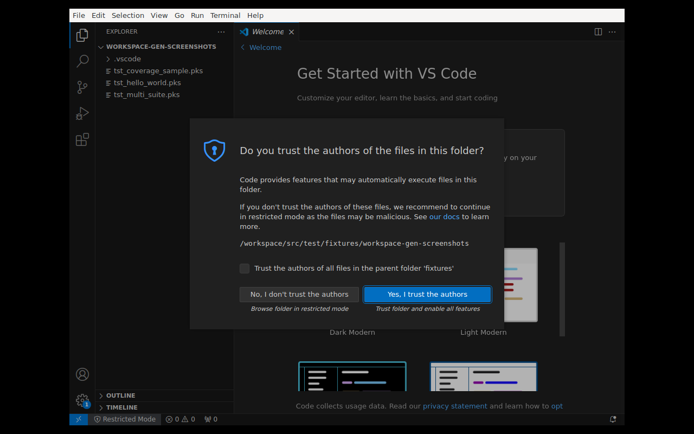
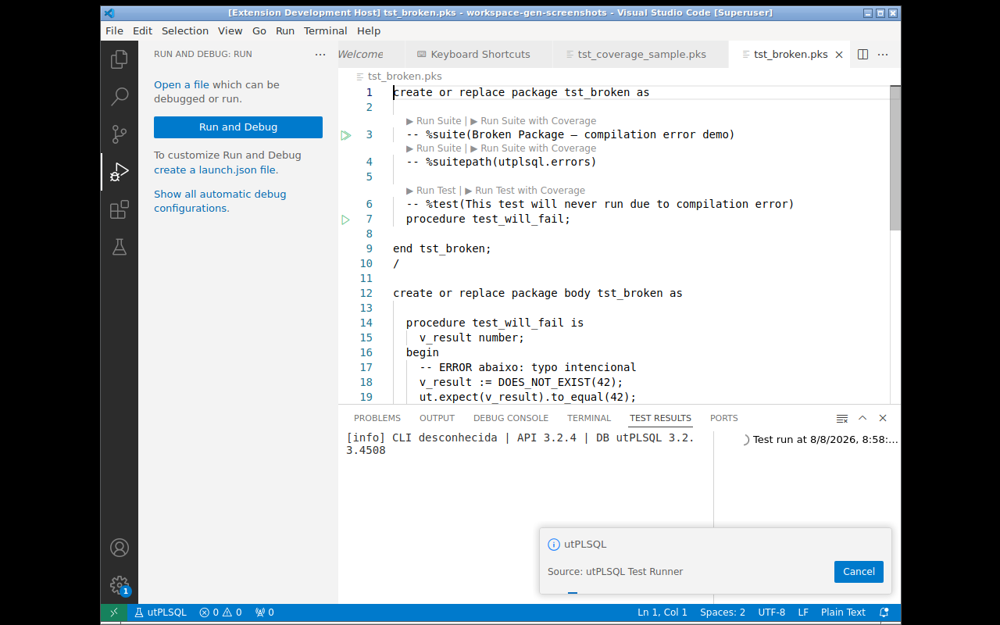

# Cobertura de código

A extensão alimenta a **Test Coverage API** do VSCode, mostrando cobertura
diretamente no editor e na aba Coverage.

- Linhas **executadas** → gutter verde 🟢
- Linhas **não executadas** → gutter vermelho 🔴
- Aba **Test Coverage** → percentual por arquivo/pasta





## Como funciona

O CLI é chamado com flags extras de cobertura:

```
utplsql run <conn> -p=<suites>
  -f=ut_coverage_cobertura_reporter -o=coverage.xml
  -source_path=<utplsql.sourcePath>
  -owner=<schema>
  ... coverageSourceArgs
```

A extensão lê o XML Cobertura e mapeia cada objeto coberto ao arquivo-fonte
usando `resolveSourceUri` (absoluto → workspace → sourcePath).

## Cobertura por declaração (Function Coverage)

Além da cobertura linha-a-linha (gutters), a aba **Test Coverage** exibe o
percentual de **declarações** (`PROCEDURE`/`FUNCTION`) executadas por arquivo.
A extensão deriva as declarações do próprio fonte e emite `DeclarationCoverage`
para a Test Coverage API:

- **Aba Test Coverage** → % de declarações por arquivo/pasta
- **Gutters por linha** → sem regressão: a cobertura linha-a-linha continua
  sendo emitida normalmente

## Mapeamento da cobertura aos arquivos

O `type_mapping` traduz o tipo capturado pelo regex no tipo Oracle.
Três convenções comuns:

### 1) Por diretório

Estrutura: `sourcePath/<tipo>/<nome>.sql`

Exemplo de projeto:
```
install/
├── packages/
│   └── calculadora.sql
├── functions/
│   └── dobro.sql
└── procedures/
    └── log_auditoria.sql
```

```jsonc
"utplsql.coverageSourceArgs": [
  "-regex_expression=.*[/\\\\](\\w+)[/\\\\](\\w+)\\.sql$",
  "-type_subexpression=1",
  "-name_subexpression=2",
  "-type_mapping=packages=PACKAGE BODY/functions=FUNCTION/procedures=PROCEDURE/triggers=TRIGGER/views=VIEW"
]
```

### 2) Por prefixo do nome

Convenção: `pkg_*`, `prc_*`, `fnc_*`

Exemplo:
```
install/
├── pkg_calculadora.sql
├── fnc_dobro.sql
└── prc_auditoria.sql
```

```jsonc
"utplsql.coverageSourceArgs": [
  "-regex_expression=.*[/\\\\]((pkg|prc|fnc|trg|vw)_\\w+)\\.sql$",
  "-name_subexpression=1",
  "-type_subexpression=2",
  "-type_mapping=pkg=PACKAGE BODY/prc=PROCEDURE/fnc=FUNCTION/trg=TRIGGER/vw=VIEW"
]
```

### 3) Por extensão tipada

Convenção: `*.pkb`, `*.fnc`, `*.prc`

Exemplo:
```
install/
├── calculadora.pkb
├── dobro.fnc
└── auditoria.prc
```

```jsonc
"utplsql.coverageSourceArgs": [
  "-regex_expression=.*[/\\\\](\\w+)\\.(\\w+)$",
  "-name_subexpression=1",
  "-type_subexpression=2",
  "-type_mapping=pkb=PACKAGE BODY/fnc=FUNCTION/prc=PROCEDURE/trg=TRIGGER"
]
```

## Notas importantes

- **Packages → `PACKAGE BODY`**: a cobertura é coletada no **corpo** do package,
  não na spec.
- **Windows e metacaracteres**: no modo `launcher`, o `cmd` consome `^` e
  interpreta `|` como pipe. Use `utplsql.invocation: "java"` para usar regex
  completo (veja [Modo de invocação](Modo-de-invocação)).
- **Validação dinâmica**: antes de rodar cobertura, a extensão verifica se
  `UT_COVERAGE_COBERTURA_REPORTER` existe no banco. Se não, cobertura é pulada
  com aviso — a execução nunca é bloqueada.

## Cobertura de views (objetos SQL)

O `DBMS_PROFILER`/`DBMS_PLSQL_CODE_COVERAGE` só instrumenta PL/SQL — views não
têm linhas para perfilar. Opções:

1. **`type_mapping` com `views=VIEW`** (padrão): as views do schema coberto
   aparecem no relatório com **0 hits** (arquivo listado, não executado).
   Estrutura esperada: `sourcePath/views/<nome>.sql`.
2. **Rastreio via `V$SQL`** (`utplsql.sqlCoverageEnabled: true`): após o run a
   extensão consulta `V$SQL` e marca cada view como **executada** (100%, verde)
   ou **não executada** (0%, vermelho). O arquivo recebe gutter **por linha**
   (todas verdes ou todas vermelhas — cobertura booleana, não há hits reais
   por linha em SQL). Requer `GRANT SELECT ON V$SQL`.
   Best-effort: falha de acesso/timeout não quebra a execução.
3. **Instrumentação manual**: para granularidade linha-a-linha, converta a
   query em um **package function** que retorna a view/cursor — o corpo entra
   na cobertura PL/SQL normal.

## Depurando regex de cobertura

Ative `utplsql.dbmsOutput: true` e inspecione o output do CLI no terminal da
view de testes. O utPLSQL loga quais objetos foram mapeados e quais falharam:

```
-- objetos mapeados pelo regex:
--   CALCULADORA → PACKAGE BODY → install/packages/calculadora.sql
--   DOBRO → FUNCTION → install/functions/dobro.sql
--   LOG_AUDITORIA → (não mapeado — nenhum arquivo correspondeu)
```


