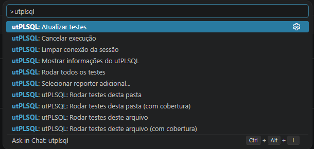
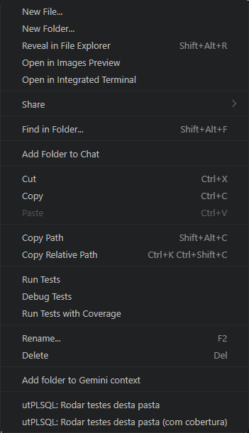
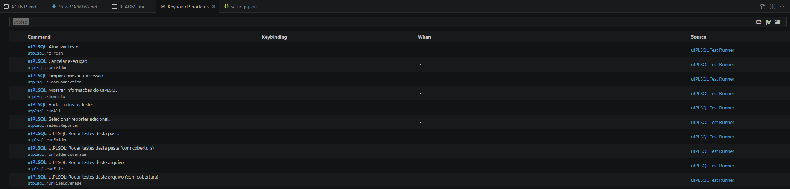

# Comandos

Todos os comandos da extensão disponíveis na palette (`Ctrl+Shift+P`),
com prefixo `utPLSQL:`.



## Lista completa

| Comando | Descrição | Atalho via UI |
|---|---|---|
| `utPLSQL: Rodar todos os testes` | Executa todas as suites do workspace | Botão ▶ na view Testing |
| `utPLSQL: Rodar testes do arquivo` | Executa suites do `.pks`/`.pkb` ativo | Clique direito → arquivo |
| `utPLSQL: Rodar testes do arquivo com cobertura` | Idem, com perfil de cobertura | Clique direito → arquivo |
| `utPLSQL: Rodar testes da pasta` | Executa suites da pasta selecionada | Clique direito → pasta |
| `utPLSQL: Rodar testes da pasta com cobertura` | Idem, com perfil de cobertura | Clique direito → pasta |
| `utPLSQL: Atualizar testes` | Força rediscovery dos `.pks` | — |
| `utPLSQL: Cancelar execução` | Interrompe o CLI em execução | — |
| `utPLSQL: Mostrar informações do utPLSQL` | Versões CLI/API/DB | — |
| `utPLSQL: Selecionar reporter adicional...` | QuickPick com reporters do banco | — |
| `utPLSQL: Limpar conexão da sessão` | Remove conexão do cache | — |

## Menu de contexto

Os comandos de execução também aparecem no menu de contexto:

- **Clique direito num arquivo** `.pks`/`.pkb` → executa as suites daquele arquivo
- **Clique direito numa pasta** → executa as suites de todos os `.pks` dentro dela



## Atalhos de teclado

Nenhum atalho padrão é atribuído. Para definir, edite o `keybindings.json`
(`Ctrl+K Ctrl+S`):

```jsonc
// Atalho para rodar todos os testes
{
  "key": "ctrl+shift+t",
  "command": "utplsql.runAll"
},
// Atalho para cancelar execução
{
  "key": "ctrl+shift+escape",
  "command": "utplsql.cancelRun"
}
```


