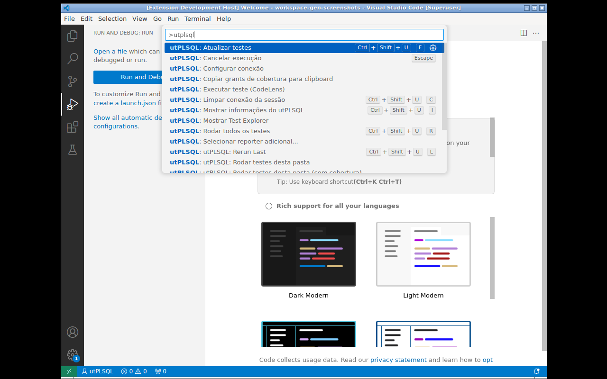
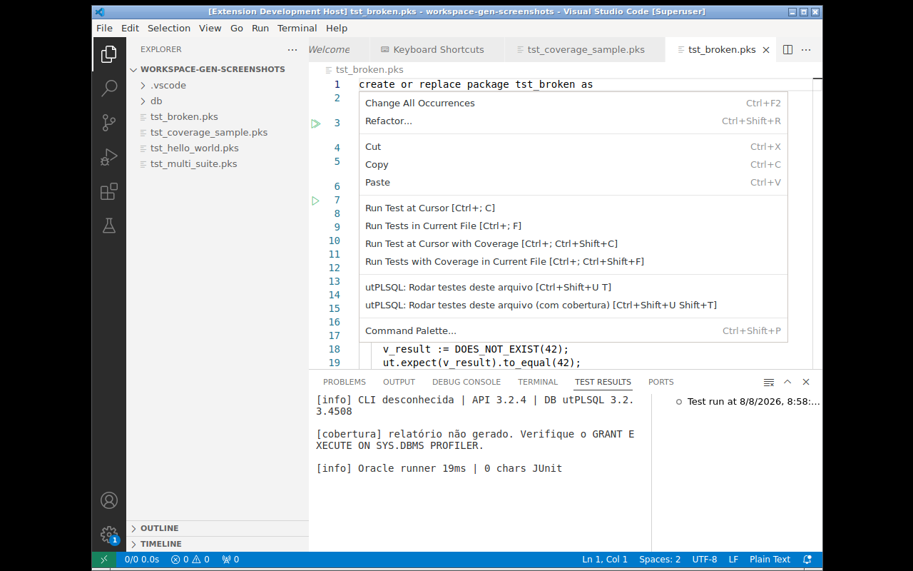
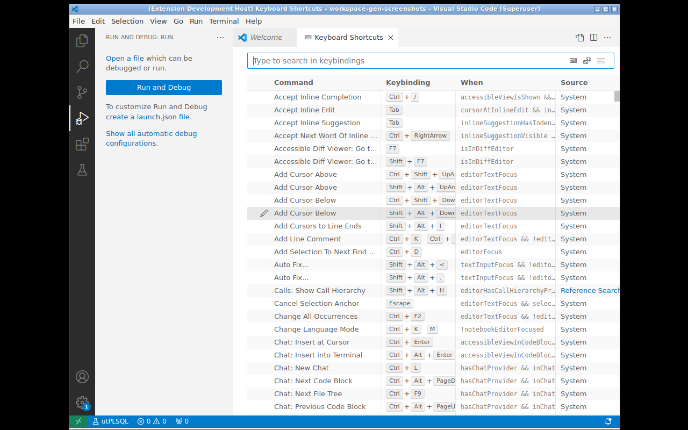

# Comandos

Todos os comandos da extensão disponíveis na palette (`Ctrl+Shift+P`),
com prefixo `utPLSQL:`.

## Lista completa

| Comando | Descrição | Atalho via UI |
|---|---|---|
| `utPLSQL: Rodar todos os testes` | Executa todas as suites do workspace | Botão ▶ na view Testing |
| `utPLSQL: Rodar testes deste arquivo` | Executa suites do `.pks`/`.pkb` ativo | Clique direito → arquivo |
| `utPLSQL: Rodar testes deste arquivo com cobertura` | Idem, com perfil de cobertura | Clique direito → arquivo |
| `utPLSQL: Rodar testes desta pasta` | Executa suites da pasta selecionada | Clique direito → pasta |
| `utPLSQL: Rodar testes desta pasta com cobertura` | Idem, com perfil de cobertura | Clique direito → pasta |
| `utPLSQL: Atualizar testes` | Força rediscovery dos `.pks` | — |
| `utPLSQL: Cancelar execução` | Interrompe a execução em andamento (CLI ou Oracle) | `Escape` |
| `utPLSQL: Mostrar informações do utPLSQL` | Versões CLI/API/DB | — |
| `utPLSQL: Selecionar reporter adicional...` | QuickPick com reporters do banco | — |
| `utPLSQL: Limpar conexão da sessão` | Remove conexão do cache | — |
| `utPLSQL: Rerun Last` | Repete a última execução | `Ctrl+Shift+U L` |
| `utPLSQL: Run Test at Cursor` | Executa o teste sob o cursor | `Ctrl+Shift+U U` |
| `utPLSQL: Run Failed Tests` | Reexecuta apenas testes falhos | `Ctrl+Shift+U X` |
| `utPLSQL: Mostrar Test Explorer` | Foca a view Testing | Clique na status bar |
| `utPLSQL: Validar configuração` | Roda validação completa do setup (inclui integridade da instalação UT3) | — |
| `utPLSQL: Configurar conexão` | Abre settings em `utplsql.connection` | — |
| `utPLSQL: Copiar grants de cobertura para clipboard` | Copia grants SQL para clipboard | — |
| `utPLSQL: Executar teste (CodeLens)` | Interno — disparado pelos botões de CodeLens | Botão ▶ sobre `%suite`/`%test` |

> **Recompilar UT3** não aparece na palette — é um quick-fix interno do
> diagnostic "utPLSQL Setup" (`UTPLSQL_INVALID_OBJECTS`).

## Menu de contexto

Os comandos de execução também aparecem no menu de contexto:

- **Clique direito num arquivo** `.pks`/`.pkb` → executa as suites daquele arquivo
- **Clique direito numa pasta** → executa as suites de todos os `.pks` dentro dela

## Atalhos de teclado

Todos os atalhos usam o prefixo `Ctrl+Shift+U` (`Cmd+Shift+U` no Mac):

| Atalho | Comando |
|---|---|
| `Ctrl+Shift+U R` | Rodar todos os testes |
| `Ctrl+Shift+U T` | Rodar testes do arquivo |
| `Ctrl+Shift+U Shift+T` | Rodar testes do arquivo com cobertura |
| `Ctrl+Shift+U F` | Atualizar testes (refresh) |
| `Ctrl+Shift+U I` | Mostrar informações do utPLSQL |
| `Ctrl+Shift+U C` | Limpar conexão da sessão |
| `Ctrl+Shift+U L` | Rerun last (último teste) |
| `Ctrl+Shift+U U` | Run at cursor (teste sob cursor) |
| `Ctrl+Shift+U X` | Run failed only (apenas falhas) |
| `Escape` | Cancelar execução |

Para redefinir, vá em File → Preferences → Keyboard Shortcuts e busque `utplsql`.

