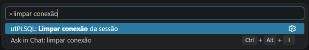

# Configuração da conexão

A extensão precisa de uma string de conexão Oracle para rodar os testes. A
resolução segue esta ordem de prioridade:

| Prioridade | Fonte | Persiste? |
|---|---|---|
| 1 | Setting `utplsql.connection` | Sim (settings.json) |
| 2 | Variável de ambiente `UTPLSQL_CONN` | Não (apenas na sessão do shell) |
| 3 | Cache da sessão (prompt anterior) | Sim, até fechar o VSCode |
| 4 | Prompt ao usuário | Não (memória volátil) |

## Recomendação de segurança

A string de conexão contém senha. **NÃO** use o setting `utplsql.connection`
em ambientes compartilhados — o `settings.json` pode ser versionado ou visível
a outros.

Prefira a **variável de ambiente `UTPLSQL_CONN`**:

**PowerShell:**
```powershell
$env:UTPLSQL_CONN = "usuario/senha@//host:1521/servico"
code .
```

**Bash:**
```bash
export UTPLSQL_CONN="usuario/senha@//host:1521/servico"
code .
```

## Formatos aceitos

### EZ Connect (recomendado)
```
user/pass@//host:1521/service
```
Exemplo: `DEV/minha_senha@//localhost:1521/XEPDB1`

### TNS alias
```
user/pass@tns_alias
```
Requer `TNS_ADMIN` configurado (variável de ambiente ou `tnsnames.ora` no
diretório padrão). Exemplo: `DEV/minha_senha@ORCLPDB1`

### Wallet (Oracle Cloud)
```
user/pass@tcps://host:1522/service?wallet_location=/caminho/wallet
```
Exemplo com Autonomous Database:
```bash
export UTPLSQL_CONN="ADMIN/minha_senha@tcps://adb.us-ashburn-1.oraclecloud.com:1522/g18a4bddbde7e2_meudb_high.adb.oraclecloud.com?wallet_location=/home/user/Wallet_meudb"
```

## Limpar conexão da sessão

Se você usou o prompt e quer trocar a conexão, use o comando da palette:

`Ctrl+Shift+P` → **utPLSQL: Limpar conexão da sessão**



Na próxima execução, a extensão pergunta a nova conexão.

## Em CI/CD

Em ambientes de integração contínua (GitHub Actions, etc.), use a env var
`UTPLSQL_CONN` como secret:

```yaml
env:
  UTPLSQL_CONN: ${{ secrets.UTPLSQL_CONN }}
```
