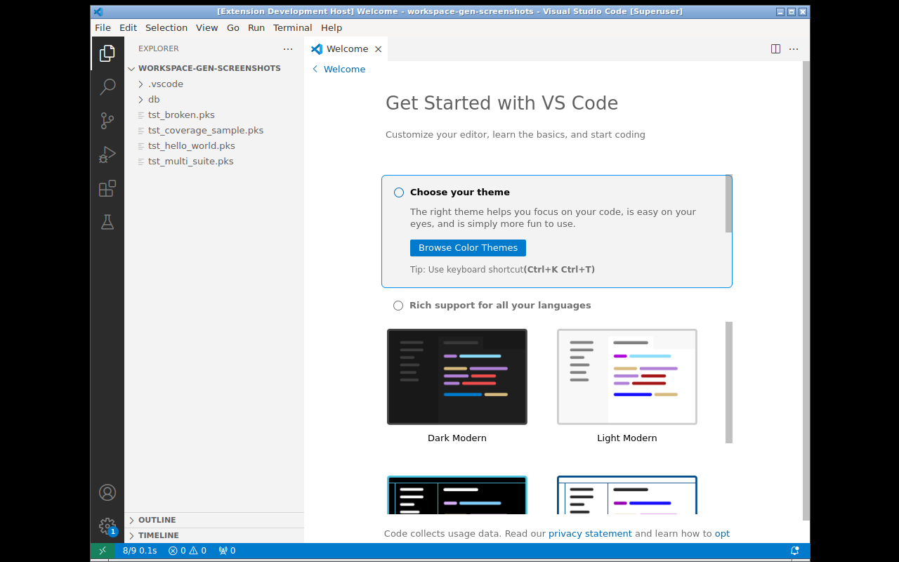

# Contributing

Guide for setting up the development environment and submitting contributions.

## Prerequisites

- **Node.js 22+** (`.nvmrc` points to 24; CI tests 22/24 — Node 20 has reached EOL)
- **npm** (comes with Node)
- **Git**
- (Optional) **Oracle Database** + **utPLSQL** for integration tests

## Environment setup

```bash
# Clone the repository
git clone https://github.com/thepaneb/vscode-utplsql.git
cd vscode-utplsql

# Install dependencies
npm install

# Compile TypeScript
npm run compile
```

## Project structure

```
vscode-utplsql/
├── src/
│   ├── extension.ts         ← orchestrator (entry point)
│   ├── runner.ts            ← executeRun + applyResults/applyCoverage wrappers
│   ├── oracleRunner.ts      ← executeRunOracle (streaming + pool) + utPLSQL schema discovery
│   ├── results.ts           ← canonical result/coverage functions (PRD-44)
│   ├── config.ts            ← settings + env vars reading + resolveConnection
│   ├── discovery.ts         ← findFiles + parse + DB-based discovery (PRD-43)
│   ├── suiteParser.ts       ← regex %suite/%test + annotations (pure)
│   ├── junit.ts             ← JUnit XML parsing + stack frames (pure)
│   ├── cobertura.ts         ← Cobertura XML parsing (pure)
│   ├── matching.ts          ← URI/folder filtering + result→test matching (pure)
│   ├── codelens.ts          ← parseCodeLensItems (pure) + CodeLensProvider
│   ├── compilationDiagnostics.ts ← PL/SQL errors in editor
│   ├── quickfix.ts          ← SetupValidator + Code Actions
│   ├── decorations.ts       ← inline pass/fail decorations
│   ├── statusBar.ts         ← status indicator
│   ├── state.ts             ← session state (pure)
│   ├── types.ts             ← interfaces (type-only)
│   └── test/
│       ├── unit/            ← tests with node --test
│       └── integration/     ← tests with @vscode/test-cli
├── dist/                    ← esbuild bundle (generated; main = dist/extension.js)
├── docs/
│   ├── prd/                 ← Product Requirements Documents
│   ├── functional/          ← functional specification
│   └── wiki/                ← wiki content
├── .github/workflows/       ← CI/CD
├── esbuild.config.mjs       ← bundling (PRD-45)
├── package.json
├── tsconfig.json
├── biome.json               ← linter + formatter
└── README.md
```

## Commands

```sh
npm install              # dependencies
npm run compile          # tsc → out/
npm run watch            # incremental compilation
npm run lint             # biome check src/
npm run lint:fix         # biome check --write src/
npm run format           # biome format --write src/
npm run test:unit        # pretest:unit (compile+lint) → node scripts/run-tests.cjs
npm run test:integration # pretest:integration (compile+bundle) → vscode-test
npm run test:coverage    # compile → c8 node --test (thresholds 65/80/70)
npm test                 # = test:unit
npm run bundle           # esbuild → dist/ (actual extension main)
npm run package          # compile + bundle + vsce package → .vsix
npm run sync-prds        # sync PRDs with GitHub issues
```

Run a single unit test:

```bash
node --test out/test/unit/junit.test.js
node --test --test-name-pattern "duration" out/test/unit/**/*.test.js
```

## Debugging

Press **F5** in VSCode (`.vscode/launch.json` configured) to open an
**Extension Development Host** instance with the extension loaded.
You can open a PL/SQL project in that window and test the extension
interactively.



## Integration tests with a real database

Create a `.env` file in the project root (gitignored):

```bash
UTPLSQL_CONN=your_user/password@//host:1521/service
```

Run:

```bash
npm run test:integration
```

Without the env vars, database tests (`describeDB`) are automatically
skipped.

## Code conventions

Style defined in `biome.json` and enforced via `npm run lint` + `npm run format`:

- Indent: **2 spaces**
- Line width: **100 characters**
- Quotes: **single** (`'`)
- Semicolons: **always** (`;`)
- Trailing commas: **always** (`,`)
- Linter: **recommended** preset

## Contribution workflow

1. **Fork** the repository
2. Create a **branch**: `git checkout -b feature/my-change`
3. Make your changes following the conventions
4. Run `npm run lint` and `npm test` — they must pass
5. Commit with a clear message
6. Push and open a **Pull Request** targeting `main`

### Commit message

Format: `<type>: <description> [(PRD-NN)]`

```
feat: add support for dynamic reporters (PRD-10)
fix: fix coverage mapping on Windows
docs: update troubleshooting section
```

If the change completes a PRD, reference `Closes #N` in the commit/PR body.

## Keeping the README and wiki updated

- **New settings** → add to the README configuration table and the wiki
  [Configuration](Configuration) page
- **New commands** → add to the README Commands section and the wiki
  [Commands](Commands) page
- **New behaviors** → if relevant for troubleshooting, add to the wiki
  [Troubleshooting](Troubleshooting) page
- **Architecture changes** → update the [Architecture](Architecture) page

The wiki is automatically synced via workflow when pushing to the `main`
branch (files in `docs/wiki/`).
