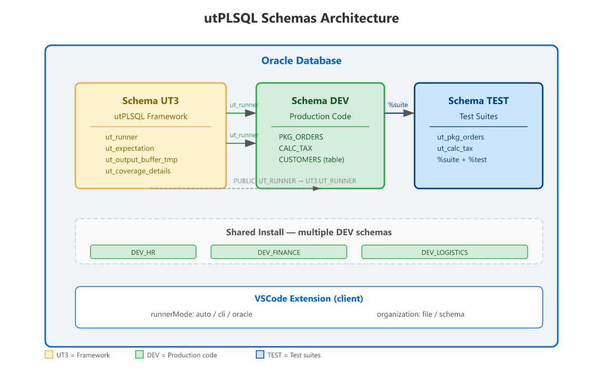

# Database requirements

Grants and configurations required on the Oracle database to use the extension
with all features.

## Coverage (always)

Enables the profiler for the schema that runs the tests:

```sql
GRANT EXECUTE ON SYS.DBMS_PROFILER TO <schema_that_runs_the_tests>;
GRANT EXECUTE ON SYS.DBMS_PLSQL_CODE_COVERAGE TO <schema_that_runs_the_tests>;
```

Without these grants, tests will run but coverage will come back **empty** (0%).

> Keep **both** grants: coverage uses `DBMS_PROFILER` and, on Oracle 19c+,
> also `DBMS_PLSQL_CODE_COVERAGE`. The `Copy coverage grants to clipboard`
> command copies both statements.

## Test discovery in OTHER schemas

When utPLSQL is installed in **shared** mode (owner `UT3` with tests in
separate application schemas), the utPLSQL owner needs to **read the
dictionary** of the application schemas:

```sql
GRANT SELECT ON SYS.DBA_SOURCE     TO <ut3_owner>;
GRANT SELECT ON SYS.DBA_OBJECTS    TO <ut3_owner>;
GRANT SELECT ON SYS.DBA_PROCEDURES TO <ut3_owner>;
```

**Important:**
- **`SELECT ANY DICTIONARY` alone is NOT enough** — direct grants on
  these views are required (due to `dbms_assert.sql_object_name` in
  definer context).
- The utPLSQL **DDL trigger** must also be installed (keeps the annotation
  cache up to date after code changes).

Verification (as the owner):
```sql
SELECT ut_metadata.get_source_view_name FROM dual;
-- should return: dba_source
```

## Schema architecture



### Shared install (recommended)

Owner `UT3` receives `SELECT ON DBA_SOURCE/OBJECTS/PROCEDURES` grants to read
annotations in application schemas (`DEV`, `TEST`, ...).

### Per-schema install

utPLSQL installed **in the same schema** as the tests — no cross-schema grants.

> In **per-schema** installs, `DBA_SOURCE`/`DBA_OBJECTS`/
> `DBA_PROCEDURES` grants are **not** required — the framework reads its
> own source.

## PL/SQL debugging (`DBMS_DEBUG`)

To debug tests (Debug Adapter `utplsql`), the schema that runs the tests needs:

```sql
GRANT DEBUG CONNECT SESSION      TO <schema_that_runs_the_tests>;
GRANT EXECUTE ON SYS.DBMS_DEBUG  TO <schema_that_runs_the_tests>;
```

The target package must also be compiled with **debug information**: Oracle
strips it at `PLSQL_OPTIMIZE_LEVEL = 2` (the default). Compile with
`PLSQL_OPTIMIZE_LEVEL <= 1` (or `ALTER PACKAGE <pkg> COMPILE DEBUG`), otherwise
breakpoints are silently ignored.

## Full verification

Run this script as DBA to audit the configuration:

```sql
-- 1. Check if utPLSQL is installed
SELECT ut_meta.version() FROM dual;

-- 2. Check profiler grants (coverage)
SELECT grantee, table_name, privilege
FROM dba_tab_privs
WHERE table_name IN ('DBMS_PROFILER', 'DBMS_PLSQL_CODE_COVERAGE')
  AND grantee IN ('UT3', 'DEV', 'TEST');

-- 3. Check dictionary grants (cross-schema discovery)
SELECT grantee, table_name, privilege
FROM dba_tab_privs
WHERE table_name IN ('DBA_SOURCE', 'DBA_OBJECTS', 'DBA_PROCEDURES')
  AND grantee = 'UT3';

-- 4. Check utPLSQL source view
SELECT ut_metadata.get_source_view_name FROM dual;
-- Expected: dba_source (shared) or all_source (per-schema)
```
