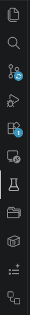
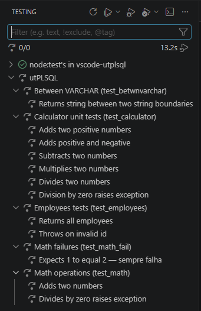
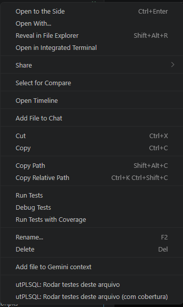
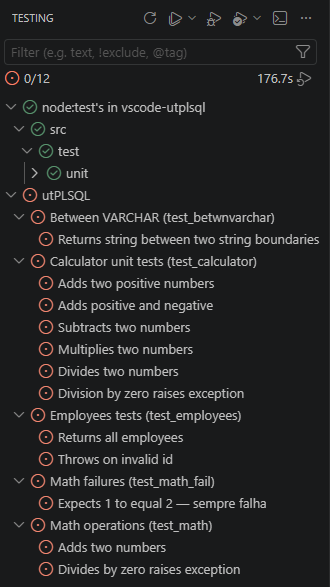

# Guia rápido

Tutorial passo a passo para rodar seu primeiro teste com a extensão.

## 1. Crie um package de teste

Crie o arquivo `tests/test_hello.pks` no seu projeto:

```sql
create or replace package test_hello as

  -- %suite(Hello World)
  -- %rollback(manual)

  -- %test(Saudação retorna Hello)
  procedure saudacao_retorna_hello;

end test_hello;
/

create or replace package body test_hello as

  function hello return varchar2 is
  begin
    return 'Hello World';
  end;

  procedure saudacao_retorna_hello is
  begin
    ut.expect(hello()).to_equal('Hello World');
  end;

end test_hello;
/
```

> Deixe uma **linha em branco** entre o `%suite` e os `%test`/procedures —
> senão o `%suite` "gruda" na procedure e o package não é reconhecido.

## 2. Compile no banco

Use sua ferramenta Oracle de preferência (SQLcl, SQL Developer, extensão Oracle
do VSCode) para compilar o package:


## 3. Abra a view de testes

Clique no ícone do **Testing** na barra lateral (ícone de frasco/lab):



As suites aparecem na árvore:



## 4. Execute os testes

Você pode rodar de várias formas:

- **Gutter**: ícone ▶ ao lado de cada teste ou suite no editor
- **Botão Run Tests**: na barra de ferramentas da view Testing
- **Clique direito**: na pasta `tests/` ou no arquivo `test_hello.pks` →
  *utPLSQL: Rodar testes...*
- **Paleta**: `Ctrl+Shift+P` → `utPLSQL: Rodar todos os testes`



## 5. Interprete os resultados

- **Verde** ✅ — teste passou
- **Vermelho** ❌ — teste falhou (mensagem de falha do utPLSQL aparece no
  tooltip e no painel de output)



## 6. Veja o output

O output do CLI (incluindo o reporter de documentação) aparece no terminal
da view de testes. Clique no teste para ver o log completo.


## 7. Cobertura (opcional)

Para ver cobertura, use o perfil **Run with Coverage** (botão ao lado de
Run Tests, ou item de menu com cobertura). Veja [Cobertura](Cobertura).

## Exemplo completo

Considere um projeto com estrutura:

```
meu-projeto/
├── install/
│   └── hello.sql         ← código de produção
└── tests/
    └── test_hello.pks    ← testes
```

Settings recomendadas (`.vscode/settings.json`):

```jsonc
{
  "utplsql.cliPath": "C:\\tools\\utPLSQL-cli\\bin\\utplsql.bat",
  "utplsql.sourcePath": "install"
  // connection via env var UTPLSQL_CONN
}
```
