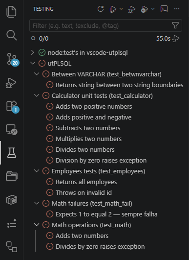

# utPLSQL Test Runner

Integra o [utPLSQL](https://www.utplsql.org/) ao VSCode, trazendo testes de PL/SQL
para o **Test Explorer** nativo, com menu de contexto e cobertura visual.

- **Test Explorer nativo** — suites e testes aparecem na view de testes
- **CodeLens** — botões Run/Run with Coverage sobre `%suite` e `%test` no editor
- **Atalhos de teclado** — prefixo `Ctrl+Shift+U` + tecla para todos os comandos (R = Run All, T = Run File, L = Rerun Last, etc.)
- **Menu de contexto** — clique direito em pasta ou arquivo `.pks`/`.pkb`
- **Cobertura visual** — gutters coloridos + percentual por arquivo
- **Decorações inline** — ícones ✓/✗/⚠ no editor após execução com tooltip da falha
- **Status Bar** — indicador com contagem pass/fail e duração
- **Smart Re-run** — Rerun Last, Run at Cursor, Run Failed Only com um atalho

## Navegação

Use a sidebar à esquerda (ou o menu ≡ no mobile) para navegar entre as seções.

- **Começando**: [Instalação e requisitos](Instalação-e-requisitos) · [Conexão](Conexão)
- **Uso**: [Guia rápido](Guia-rápido) · [Cobertura](Cobertura) · [Reporters](Reporters)
- **Referência**: [Configurações](Configurações) · [Comandos](Comandos) · [Modo de invocação](Modo-de-invocação) · [Requisitos no banco](Requisitos-no-banco)
- **Desenvolvimento**: [Arquitetura](Arquitetura) · [Como contribuir](Como-contribuir) · [Testes](Testes) · [PRDs e roadmap](PRDs)
- **Ajuda**: [Troubleshooting](Troubleshooting) · [FAQ](FAQ)

## Links

- [Repositório](https://github.com/thepaneb/vscode-utplsql)
- [Marketplace](https://marketplace.visualstudio.com/items?itemName=paneb.vscode-utplsql)
- [utPLSQL Framework](https://github.com/utPLSQL/utPLSQL)
- [utPLSQL-cli](https://github.com/utPLSQL/utPLSQL-cli/releases)
