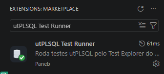
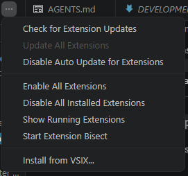

# Instalação e requisitos

## Instalação

A extensão pode ser instalada de duas formas:

### 1. Pelo Marketplace

Procure por **utPLSQL Test Runner** no painel de extensões do VSCode
(`Ctrl+Shift+X`) e clique em **Instalar**.



### 2. Manualmente (.vsix)

Baixe o arquivo `.vsix` da [página de releases](https://github.com/thepaneb/vscode-utplsql/releases)
e instale:

**Linha de comando:**
```bash
code --install-extension vscode-utplsql-0.7.2.vsix
```

**Interface:** Painel de Extensões (`Ctrl+Shift+X`) → `...` (canto superior direito)
→ **Install from VSIX...**



## Requisitos

### Banco de dados

- [**utPLSQL**](https://github.com/utPLSQL/utPLSQL) **(UT3)** instalado no banco Oracle.

Para verificar se o utPLSQL está instalado:
```sql
SELECT ut_meta.version() FROM dual;
-- deve retornar algo como: v3.2.3
```


### Máquina local

- [**utPLSQL-cli**](https://github.com/utPLSQL/utPLSQL-cli/releases) + **Java** instalados.

Para verificar:
```bash
java -version
# openjdk version "21.0.5" 2024-10-15 LTS

utplsql --version
# utPLSQL-cli v3.2.3
```

- **VSCode 1.88+** (requerido pela Test Coverage API).

### Compatibilidade

| Oracle | utPLSQL | utPLSQL-cli | VSCode | Extensão |
|---|---|---|---|---|
| 19c+ | v3.1.0+ | v3.1.0+ | 1.88+ | 0.3.0+ |
| 23ai | v3.2.0+ | v3.2.0+ | 1.88+ | 0.6.0+ |

> A extensão é só o cliente gráfico — quem executa os testes é o banco Oracle via CLI.
