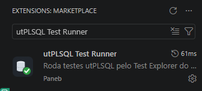
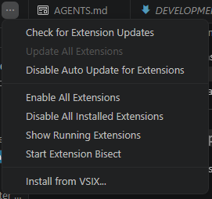
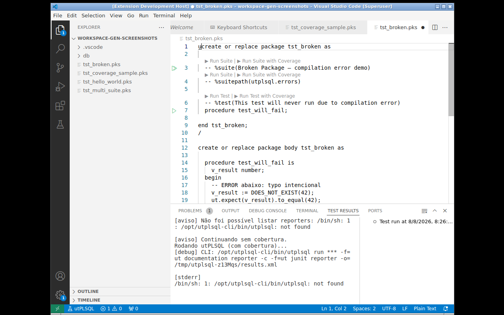

# Installation and Requirements

## Installation

The extension can be installed in two ways:

### 1. From the Marketplace

Search for **utPLSQL Test Runner** in the VSCode Extensions panel
(`Ctrl+Shift+X`) and click **Install**.



### 2. Manually (.vsix)

Download the `.vsix` file from the [releases page](https://github.com/thepaneb/vscode-utplsql/releases)
and install:

**Command line:**
```bash
code --install-extension vscode-utplsql-0.12.0.vsix
```

**UI:** Extensions Panel (`Ctrl+Shift+X`) → `...` (top-right corner)
→ **Install from VSIX...**



## Requirements

### Database

- [**utPLSQL**](https://github.com/utPLSQL/utPLSQL) **(UT3)** installed on the Oracle database.

To verify whether utPLSQL is installed:
```sql
SELECT ut_meta.version() FROM dual;
-- should return something like: v3.2.3
```



### Local machine

- **VSCode 1.88+** (required by the Test Coverage API).
- Nothing else — the VSIX already includes the `oracledb` thin driver (no Instant Client needed).

### Compatibility

| Oracle | utPLSQL | VSCode | Extension |
|---|---|---|---|
| 19c+ | v3.1.0+ | 1.88+ | 0.3.0+ |
| 23ai | v3.2.0+ | 1.88+ | 0.6.0+ |

> The extension is just the GUI client — tests are executed by the Oracle
> database, via node-oracledb (thin driver).
