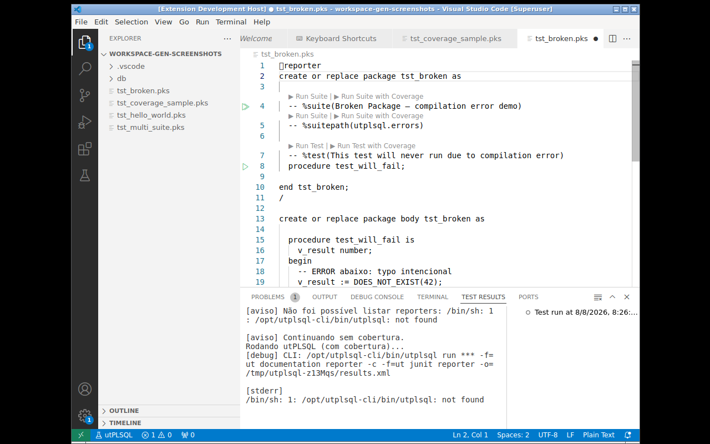

<!-- GENERATED FROM docs/brain/70-Wiki/Reporters.md — DO NOT EDIT -->

# Custom Reporters

The extension registers reporters per run. Two are always present; coverage is
added only when running **with coverage**:

| Reporter | Output | Purpose |
|---|---|---|
| `ut_documentation_reporter` | `UT_OUTPUT_BUFFER_TMP` (in-database, streamed) | Test output in the run log |
| `ut_junit_reporter` | `UT_OUTPUT_BUFFER_TMP` (in-database, streamed) | Results → Test Explorer |
| `ut_coverage_cobertura_reporter` | `UT_OUTPUT_BUFFER_TMP` (in-database, streamed) | Coverage → gutters + Coverage tab (only with coverage) |

All reporters write to the same in-database buffer table
(`UT_OUTPUT_BUFFER_TMP`); there are no `results.xml`/`coverage.xml` files. The
extension polls the buffer and streams the output in real time.

## Dynamic Coverage Validation

Before running with coverage, the extension queries the database via
`TABLE(ut_runner.get_reporters_list())` — scoped to the discovered utPLSQL schema
prefix. If `UT_COVERAGE_COBERTURA_REPORTER` does not exist (e.g., outdated
utPLSQL), coverage is **skipped with a warning** in the output. Test execution is
never blocked.

## Fixed Additional Reporters

Setting `utplsql.additionalReporters` — included in every run:

```jsonc
"utplsql.additionalReporters": ["UT_COVERAGE_HTML_REPORTER"]
```

The default reporters are automatically deduplicated — you don't need
to remove them from the list.

## Volatile Session Reporter

Palette command **utPLSQL: Select Additional Reporter...**:

1. Opens a QuickPick with the dynamic list of reporters available in the database
2. The chosen reporter is stored in the session state and **applied to the next
   run** (consumed by `executeRunOracle` via `consumeExtraReporter()`, logged as
   `[info] Reporter adicional da sessão`)

To actually include an extra reporter, use the fixed `utplsql.additionalReporters`
setting.



The QuickPick lists the reporters reported by the database; the chosen reporter
is stored in the session state and **applied to the next run** (consumed by
`executeRunOracle` via `consumeExtraReporter()`).

## Creating a Custom Reporter

Minimal example of a PL/SQL reporter that logs to a table:

```sql
create table test_report_log (
  test_name varchar2(200),
  status varchar2(20),
  duration interval day to second,
  run_ts timestamp default systimestamp
);

create or replace package custom_reporter as
  -- %suite(Custom Reporter)

  procedure before_calling_run;
  procedure after_calling_run;

  procedure before_calling_suite(a_suite ut_suite_item);
  procedure after_calling_suite(a_suite ut_suite_item);

  procedure before_calling_test(a_test ut_test);
  procedure after_calling_test(a_test ut_test);
end;
/

create or replace package body custom_reporter as

  procedure before_calling_run is begin null; end;

  procedure after_calling_run is begin null; end;

  procedure before_calling_suite(a_suite ut_suite_item) is begin null; end;

  procedure after_calling_suite(a_suite ut_suite_item) is begin null; end;

  procedure before_calling_test(a_test ut_test) is begin null; end;

  procedure after_calling_test(a_test ut_test) is
    v_status varchar2(20);
  begin
    select status into v_status
      from ut_test_result where test_id = a_test.id;

    insert into test_report_log (test_name, status, duration)
    values (a_test.name, v_status, a_test.execution_time);
  end;

end;
/
```

To use it, add it to `additionalReporters`:

```jsonc
"utplsql.additionalReporters": ["CUSTOM_REPORTER"]
```

> Custom reporters receive callback calls from the utPLSQL framework
> during execution. For API details, see the
> [utPLSQL documentation](https://github.com/utPLSQL/utPLSQL).
