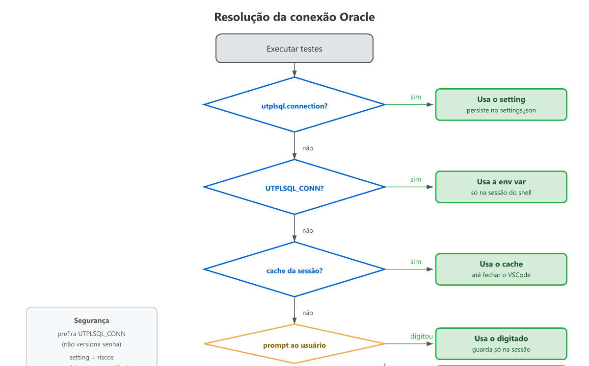
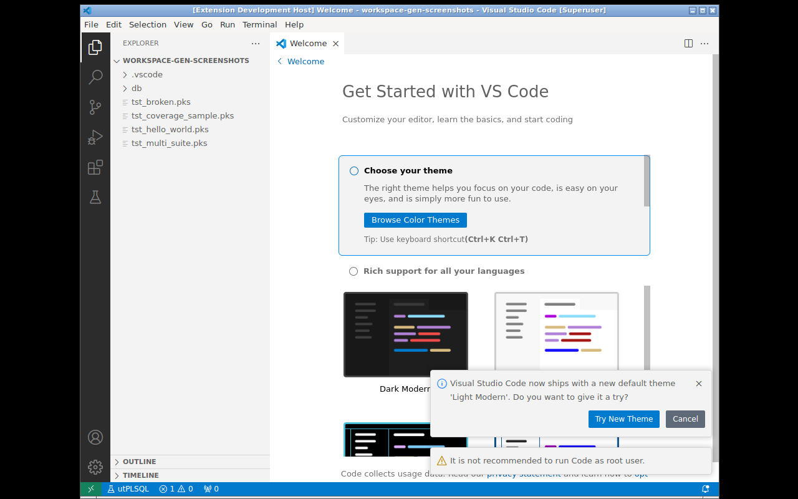

# Connection Configuration

The extension requires an Oracle connection string to run tests. The
resolution follows this priority order:

| Priority | Source | Persists? |
|---|---|---|
| 1 | Active profile (`utplsql.activeProfile` → `profile.connection`) | Yes (settings.json) |
| 2 | Setting `utplsql.connection` | Yes (settings.json) |
| 3 | Environment variable `UTPLSQL_CONN` | No (shell session only) |
| 4 | Session cache (previous prompt) | Yes, until VSCode is closed |
| 5 | User prompt | No (volatile memory) |



## Security Recommendation

The connection string contains a password. **DO NOT** use the `utplsql.connection`
setting in shared environments — the `settings.json` may be version-controlled or
visible to others.

Prefer the **`UTPLSQL_CONN` environment variable**:

**PowerShell:**
```powershell
$env:UTPLSQL_CONN = "user/password@//host:1521/service"
code .
```

**Bash:**
```bash
export UTPLSQL_CONN="user/password@//host:1521/service"
code .
```

## Accepted Formats

### EZ Connect (recommended)
```
user/pass@//host:1521/service
```
Example: `DEV/my_password@//localhost:1521/XEPDB1`

### TNS alias
```
user/pass@tns_alias
```
Requires `TNS_ADMIN` to be configured (environment variable or `tnsnames.ora` in
the default directory). Example: `DEV/my_password@ORCLPDB1`

### Wallet (Oracle Cloud)
```
user/pass@tcps://host:1522/service?wallet_location=/path/to/wallet
```
Example with Autonomous Database:
```bash
export UTPLSQL_CONN="ADMIN/my_password@tcps://adb.us-ashburn-1.oraclecloud.com:1522/g18a4bddbde7e2_mydb_high.adb.oraclecloud.com?wallet_location=/home/user/Wallet_mydb"
```

## Clearing the Session Connection

If you used the prompt and want to switch connections, use the palette command:

`Ctrl+Shift+P` → **utPLSQL: Clear Session Connection**



On the next run, the extension will ask for the new connection.

## In CI/CD

In continuous integration environments (GitHub Actions, etc.), use the
`UTPLSQL_CONN` environment variable as a secret:

```yaml
env:
  UTPLSQL_CONN: ${{ secrets.UTPLSQL_CONN }}
```