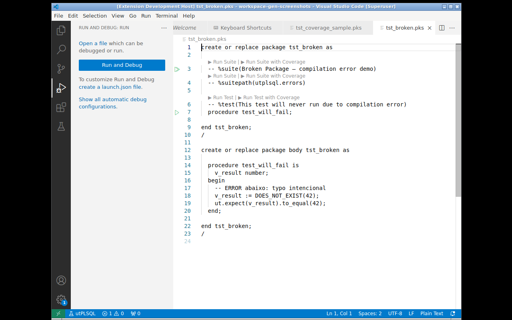
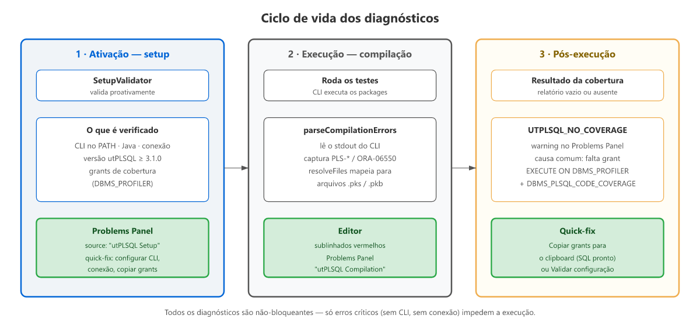

# Diagnostics and quick-fix

The extension provides two types of automatic diagnostics to reduce setup
friction and accelerate the TDD cycle:

1. **Compilation diagnostics** — PL/SQL compilation errors captured via
   the `ALL_ERRORS` query and displayed as underlines in the editor.
2. **Setup diagnostics** — proactive validation of connection, grants, and
   utPLSQL version, with **quick-fix actions** in the Problems Panel.

---

## Compilation diagnostics

After each test execution, the extension queries the Oracle database's
`ALL_ERRORS` view for compilation errors and displays them as
`vscode.Diagnostic` in the editor.

### How it works

```
executeRun() → Oracle executes → conn1 collects errors via ALL_ERRORS
  → compilationDiagnostics.parseFromOutput() → resolveFiles() → apply()
  → VSCode Problems Panel shows the errors
  → Editor shows red underlines
```

### Example

If a test package has a syntax error:

```sql
create or replace package test_foo as
  -- %suite(Foo)
  procedure bar;
end;
-- missing END; in body
```

The `ALL_ERRORS` query will return:
```
TEST_FOO  PACKAGE BODY  12  5  PLS-00103: Encountered the symbol "END"
```

The extension extracts this and shows it in the editor:
- **File:** `tests/test_foo.pks`
- **Line 12, column 5** — red underline
- **Problems Panel:** `[PLS-00103] Encountered the symbol "END"` (source: "utPLSQL Compilation")



### Configuration

```jsonc
{
  // Enabled by default. Disable to remove underlines:
  "utplsql.compilationDiagnostics.enabled": false
}
```

### Limitations

- Maps errors to `.pks`/`.pkb` files in the workspace. External code
  (e.g., Oracle standard packages) is ignored.

---

## Setup diagnostics

On extension activation, the `SetupValidator` proactively checks for
common setup issues:

| Check | Diagnostic | Severity |
|---|---|---|
| Invalid Oracle connection | `UTPLSQL_BAD_CONN` | Error |
| utPLSQL < 3.1.0 on the database | `UTPLSQL_OLD_VERSION` | Warning |
| Invalid objects in the utPLSQL schema | `UTPLSQL_INVALID_OBJECTS` | Warning |
| Coverage failed (post-execution) | `UTPLSQL_NO_COVERAGE` | Warning |

The invalid objects check (`ALL_OBJECTS` for `PACKAGE`/`TYPE`/
`PACKAGE BODY` in the utPLSQL schema) is best-effort: asynchronous, no
connection prompt, 5s timeout, and silent on failure. The
`setupDiagnostics.enabled: false` setting disables the check.

Results appear in the **Problems Panel** with source "utPLSQL Setup".

### Quick-fix actions

Each diagnostic provides a **Code Action** (lightbulb icon or `Ctrl+.`):

| Diagnostic | Quick-fix |
|---|---|
| Invalid connection | **Reconfigure connection** → opens settings at `utplsql.connection` |
| Coverage grants | **Copy grants to clipboard** → copies ready-to-paste SQL |
| Invalid objects in utPLSQL | **Recompile UT3** → `DBMS_UTILITY.COMPILE_SCHEMA` and re-checks |

### Commands

| Command | Description |
|---|---|
| `utPLSQL: Validate configuration` | Runs full validation (setup + utPLSQL installation integrity) and shows result in Problems Panel |
| `utPLSQL: Configure connection` | Opens settings at `utplsql.connection` |
| `utPLSQL: Copy coverage grants` | Copies `GRANT EXECUTE ON DBMS_PROFILER ...` to clipboard |

> **Recompile UT3** is not a palette command — it is a quick-fix
> (`utplsql.recompileUt3`, internal) available only in the
> `UTPLSQL_INVALID_OBJECTS` diagnostic.

### Configuration

```jsonc
{
  // Enabled by default. Disable to remove diagnostics:
  "utplsql.setupDiagnostics.enabled": false
}
```

---

## Interaction between diagnostics

The full diagnostic flow covers the entire lifecycle:



```
Open workspace
  → Setup diagnostics: Connection OK? Version OK? utPLSQL installation intact?
  → If issues: Problems Panel + quick-fix actions

Run tests
  → Compilation diagnostics: PL/SQL errors in the editor

After execution
  → If coverage failed: diagnostic with grants
```

All diagnostics are **non-blocking** — tests run even with warnings.
Only critical errors (no connection) prevent execution.
