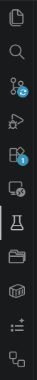
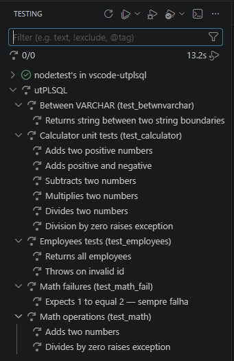
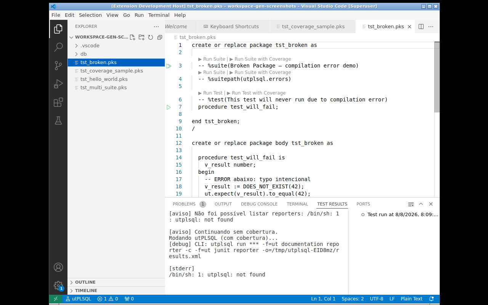

# Quick start

Step-by-step tutorial to run your first test with the extension.

## 1. Create a test package

Create the file `tests/test_hello.pks` in your project:

```sql
create or replace package test_hello as

  -- %suite(Hello World)
  -- %rollback(manual)

  -- %test(Greeting returns Hello)
  procedure greeting_returns_hello;

end test_hello;
/

create or replace package body test_hello as

  function hello return varchar2 is
  begin
    return 'Hello World';
  end;

  procedure greeting_returns_hello is
  begin
    ut.expect(hello()).to_equal('Hello World');
  end;

end test_hello;
/
```

> The parser is token-driven — there is no requirement for a blank line between
> `%suite` and the `%test`/procedures.

### Supported annotations (v0.10.0+)

In addition to `%suite` and `%test`, the extension recognizes the following during discovery:

| Annotation | Effect |
|---|---|
| `-- %disabled` | Suite or test **does not appear** in the Test Explorer |
| `-- %throws(-20001)` | Test that expects exception 20001 (metadata) |
| `-- %tags(fast, critical)` | Test tags (metadata) |
| `-- %displayname(Name)` | Display name shown in place of the `%test` description |
| `-- %beforeall` / `%beforeeach` / `%aftereach` / `%afterall` | Suite lifecycle hooks (metadata) |

```sql
-- %suite(Hello World)

-- %test(Greeting returns Hello)
-- %displayname(Greeting)
-- %tags(fast, smoke)
procedure greeting_returns_hello;

-- %test(Disabled behavior temporarily)
-- %disabled
procedure disabled_test;
```

Case-insensitive. Annotations in the suite header (between `%suite` and the first
`%test`) apply to the suite; after `%test`, they apply to the test.


## 2. Compile to the database

Use your preferred Oracle tool (SQLcl, SQL Developer, VSCode Oracle
extension) to compile the package:


## 3. Open the test view

Click the **Testing** icon in the sidebar (flask/lab icon):



The suites appear in the tree:



## 4. Run the tests

You can run tests in several ways:

- **CodeLens** — ▶ **Run** and **Run with Coverage** buttons above each `%suite` and `%test` in the editor
- **Gutter**: ▶ icon next to each test or suite in the editor
- **Run Tests button**: in the Testing view toolbar
- **Right-click**: on the `tests/` folder or the `test_hello.pks` file →
  *utPLSQL: Run tests...*
- **Palette**: `Ctrl+Shift+P` → `utPLSQL: Run all tests`



## 5. Interpret the results

- **Green** ✅ — test passed
- **Red** ❌ — test failed (the utPLSQL failure message appears in
  the tooltip and output panel)


## 6. View the output

The test output (including the documentation reporter) appears in the
Test View terminal. Click on a test to see the full log.


## 7. Coverage (optional)

To view coverage, use the **Run with Coverage** profile (button next to
Run Tests, or menu item with coverage). See [Coverage](Coverage).

## 8. Re-run quickly

Use the re-run shortcuts to speed up the TDD cycle:

| Shortcut | Description |
|---|---|
| `Ctrl+Shift+U L` | **Rerun Last** — repeats the last run (with/without coverage) |
| `Ctrl+Shift+U U` | **Run at Cursor** — runs the `%test` or `%suite` under the cursor |
| `Ctrl+Shift+U X` | **Run Failed Only** — re-runs only the tests that failed |

See [Commands](Commands) for the full list.

## Complete example

Consider a project with this structure:

```
my-project/
├── install/
│   └── hello.sql         ← production code
└── tests/
    └── test_hello.pks    ← tests
```

Recommended settings (`.vscode/settings.json`):

```jsonc
{
  "utplsql.sourcePath": "install"
  // connection via env var UTPLSQL_CONN
}
```
