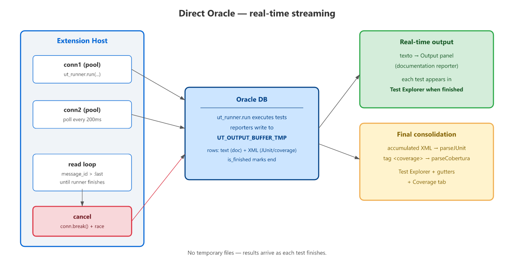

# Execução Oracle direta (streaming)

A extensão executa testes diretamente no banco Oracle via
[node-oracledb](https://node-oracle.readthedocs.io/), com resultados em
**tempo real** — cada teste aparece no Test Explorer assim que termina, sem
esperar o batch completo.

## Como funciona



1. A extensão abre **duas conexões** Oracle via `node-oracledb` (thin driver, sem Instant Client).
2. A **conn1** executa `ut_runner.run(a_paths => ..., a_reporters => ...)` — bloqueante.
3. A **conn2** faz polling da tabela `UT_OUTPUT_BUFFER_TMP` a cada 200ms.
4. Linhas de documentation (texto) são exibidas em tempo real no Output.
5. Linhas XML (JUnit) são acumuladas e parseadas ao final com `parseJUnit()`.
6. Coverage é extraído do mesmo buffer (tag `<coverage` no XML).

**Vantagens:**
- Feedback instantâneo — cada teste aparece no Explorer assim que termina
- Cancelamento interrompe o statement em execução (`conn.break()` nas duas
  conexões + `Promise.race`)
- Sem arquivos temporários (`results.xml`, `coverage.xml`)
- Resultados preservados mesmo se o processo falhar no meio

## Pré-requisitos

### node-oracledb

O VSIX já inclui o `oracledb` **thin** (puro JavaScript, sem Oracle Instant
Client — os binários nativos do thick são podados no empacotamento).

### Connection pooling (v0.10.0)

As conexões do Oracle runner vêm de um **pool gerenciado** (não mais conexões
raw por execução):

- Pool criado **lazy** na primeira execução; reutilizado nas seguintes
- **Recriado automaticamente** se a conexão mudar (setting editado ou
  `utPLSQL: Limpar conexão` + nova conexão)
- Health check de conexões ociosas via `poolPingInterval` (ping interno do
  Thin driver — sem `SELECT 1 FROM DUAL` extra)
- Fechado no `deactivate()` com drenagem de 10s
- Tamanho configurável: `utplsql.oraclePoolMin/Max/Increment/PingInterval`

Se o pool não puder ser criado (ex.: banco inacessível), o runner usa conexão
raw como fallback.

### Grants no banco (shared install)

Se o utPLSQL estiver instalado em um schema separado (ex.: `UT3`), o DBA precisa
conceder acesso às tabelas de buffer usadas pelo polling:

```sql
-- Como DBA (ou owner UT3):
GRANT SELECT, DELETE ON UT3.UT_OUTPUT_BUFFER_TMP TO PUBLIC;
GRANT SELECT, DELETE ON UT3.UT_OUTPUT_BUFFER_INFO_TMP TO PUBLIC;
```

Sem esses grants, a execução falha com `ORA-00942`.

> Em instalação **por schema** (utPLSQL no mesmo schema dos testes), esses grants
> não são necessários — as tabelas estão no próprio schema.

### Cobertura

A cobertura requer `GRANT EXECUTE ON SYS.DBMS_PROFILER` no schema dos testes.

## Troubleshooting

| Sintoma | Solução |
|---|---|
| `ORA-00942: table does not exist` | Execute os grants nas tabelas de buffer (veja acima) |
| Conexão recusada | Verifique formato: `user/pass@//host:port/service` |
| Coverage não funciona | `GRANT EXECUTE ON DBMS_PROFILER` no schema dos testes |
